# Assets Navigation Lab

This module showcases the Decision Central environment provisioned during the _Environment Setup Lab_. The business assets are retrieved from the `mortgages` project, one of the demonstration projects available out of the box for Decision Central.

In this lab, you explore the integration between a web application and the execution server engine (Decision Server) for Red Hat Decision Manager 7. You also navigate through the project import and export options in Decision Central and identify and search for different business assets in the project's library.

## Goals

* Become familiar with business assets and their organization
* Become familiar with the business asset icons and representations
* Search for and open business assets for viewing and editing

## Prerequisites

* Successful completion of the _0. Environment Setup Lab_
* Successful login to Decision Central

## Import Project

1. To start, access your Decision Central by opening this your in your browser:

| Decision Central URL                   | User      | Password     |
| -------------------------------------- | --------- | ------------ |
| http://localhost:8080/decision-central | `dmAdmin` | `redhatdm1!` |

2. The Decision Central project library view is displayed when you click *Design* from the Decision Central home page. 

3. Select the `My Space` project. The project library view shows available projects in the library. If the library is empty, it shows "Nothing Here":

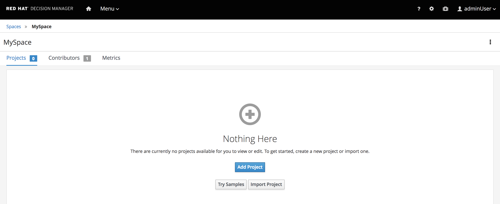

With an empty project library view, you have the option to create a project or import an existing project.

The empty library view also includes a *Try Samples* button. Clicking this button displays a list of preexisting demonstration projects that you can use to showcase the product's capabilities.

Now, you will import the `mortgages` project.

1. From the empty project library view, click *Import Project*.

* Expect to see an *Import Project* dialog where you specify a Git repository URL for the project.
  . In the *Import Project* dialog, enter `https://github.com/gpe-mw-training/bxms_decision_mgmt_foundations_lab.git` for *Repository URL*:
  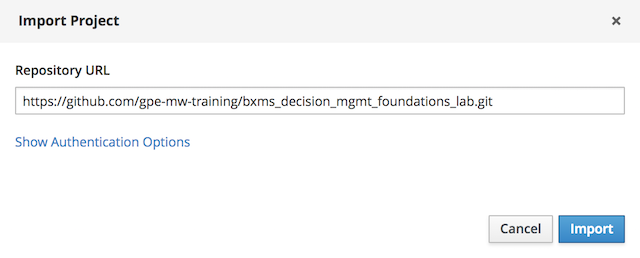

* After clicking the image:images/import_button.png[] button,expect to see a list of projects in the repository:

* Select the `mortgages` project and click *Ok* in the top right corner.
* When the import is completed, the project library view appears with the `mortgages` project selected:
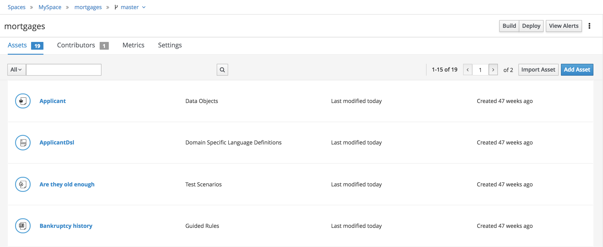

## Navigate Project Library

The project library view shows a tabular list of the assets in the project. The tabular list allows the user to:

* Search for assets.
* Display a different number of assets per table page.
* Navigate between asset pages.

### Search for Assets

At the top of the tabular list of assets, you see a search input field. As you type characters into this field, the grid of assets is filtered by the search string. The grid is filtered by the asset's fully-qualified name, and the match is not case-sensitive.

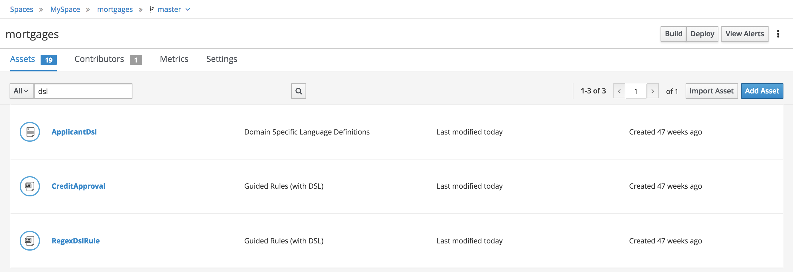

* Search for `dsl`.
* Search for `scenario`.
* Search for `bankruptcy`.
* Clear the search field.

### Display Assets Type

Next to the assets search field, there is a drop-down that allows the user to display only assets of certain type.

* Find assets type drop-down.
*  Select `Decision` to display decision related assets such as DRLs and test scenarios.
*  Select `Model` to display the models used for the decisions.

## Download Project

Projects can be exported so you can use them to upload to a source code repository and import them later into another instance of Decision Central or distribute them outside the environment where they were created.

### Export Project

To export the project, you start from Decision Central's home page.

1. Click the *Home* icon from the upper panel to access the Decision Central home page

2. Click *Design* to display the project list. Note that the empty project library view you saw earlier is now populated with a list of projects.

3. Select the `mortgages` project. This shows the project's library view with a list of its assets.

4. Select the `Applicant` asset from the top of the list, and if the *Project Explorer* panel is not displayed, click the blue *>* icon to open it. This opens the *Project Explorer* perspective:

   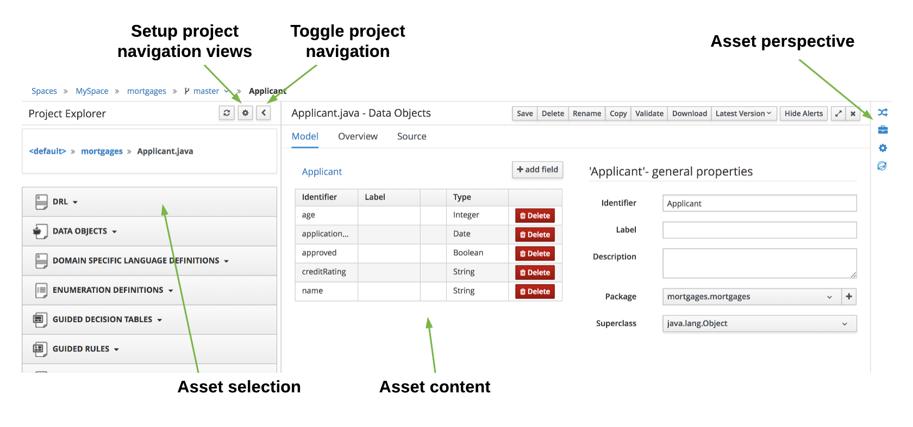

The *Project Explorer* view is accessible only when you select any of the assets from the project's library view.

*   Click the gear icon in the *Project Explorer* panel and select *Download Project*
to trigger the download in your browser:

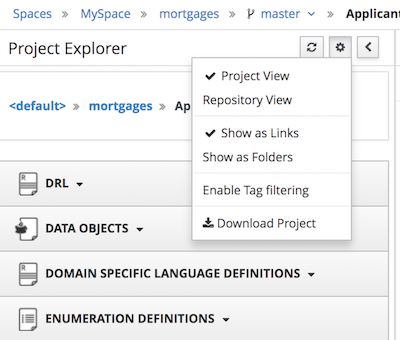

* A ZIP file containing the package structure of your project is downloaded to your `Downloads` folder. The name of the ZIP file is structured like this: `[Space Name]_[project name].zip`.

* Expect to find a file called `MySpace_mortgages.zip` in your `Downloads` folder.

### Deploy Mortgages Demonstration Project

It is useful to know how to create an executable component from a project. Executable components are stored in a binary repository (Maven) so that they can be used as dependencies for other projects. Executable components are also distributed to _execution servers_. Execution servers are the runtime containers that allow rules execution from client applications.

In this section, you deploy the `mortgages` demonstration project and use a containerized application to test the deployment.

The `mortgages` demonstration project is a Decision Manager project intended to demonstrate the use of Decision Server to evaluate a mortgage loan application for approval.

* Click the *Home* icon  from the upper panel to access the Decision Central home page.
  * Click *Design* to show the project list.
  * Select the `mortgages` project.

* This shows the project's library view with a list of its assets. Click the *Build* button to build the project.
* Expect to see confirmation of a successful build. 
* Click the *Deploy* button to deploy the project.
* Go to the `Deploy` perspective by clicking on the *Home* icon then click *Deploy*.
* This shows the list of servers and containers:
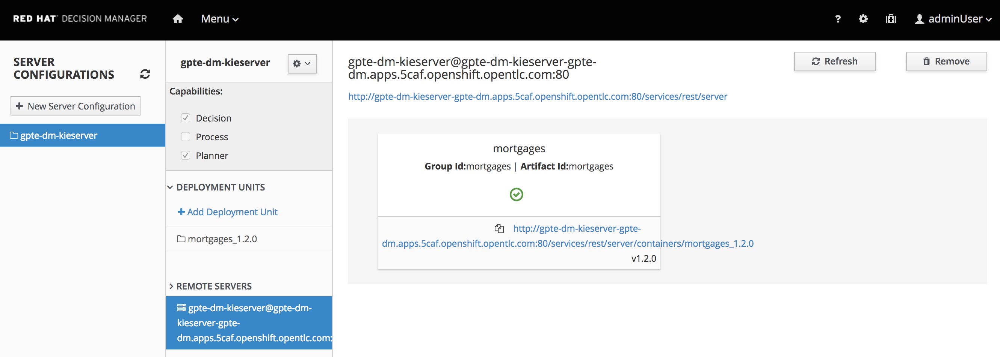

* Verify that the `mortgages` KIE container shows a green circle with a checkmark, indicating successful deployment.

* Click the link in the bottom of the `Deployment Unit Status Card`, the one located below the green checkmark.
* Provide the `adminUser` credentials.
* Observe the *Response body* results.

  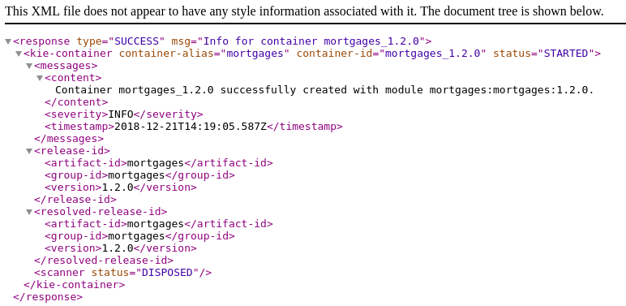

**NOTE:**  The `/services/rest/server` endpoints of Decision Server are _secured resources_. This means that you need to present credentials to access the resource. Use `adminUser` for the username and `r3dh4t1!` for the password.

### Explore Mortgages Web Application [WIP]

Along with Decision Central and Decision Server, the provisioned environment also deploys a web application to showcase interaction with the Decision Server REST API. In this section, you use the web application and find the rules that make decisions based on the input.

In this section, you locate the web application route.

//TODO: Insert information on how to run`angular-dmf-ng-dmf` using a docker image

The `angular-dmf-ng-dmf` application is a web application that helps interacting with Decision Server throughout the lab. In the left panel of the `angular-dmf-ng-dmf` application, click *Mortgages*:

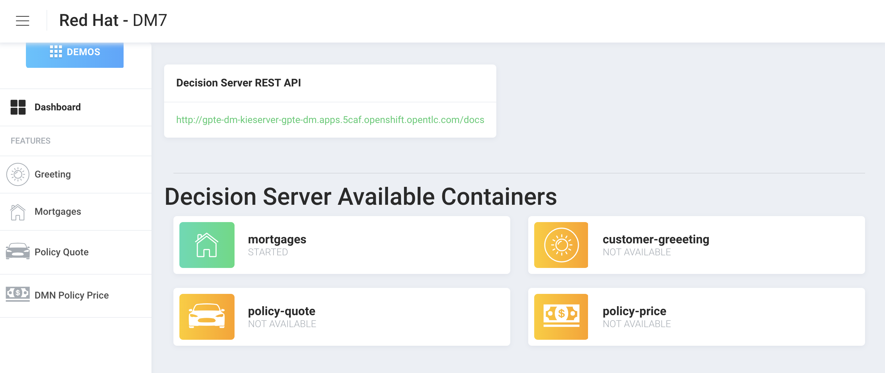

The `Mortgages` component interacts with the `mortgages` container in Decision Server:
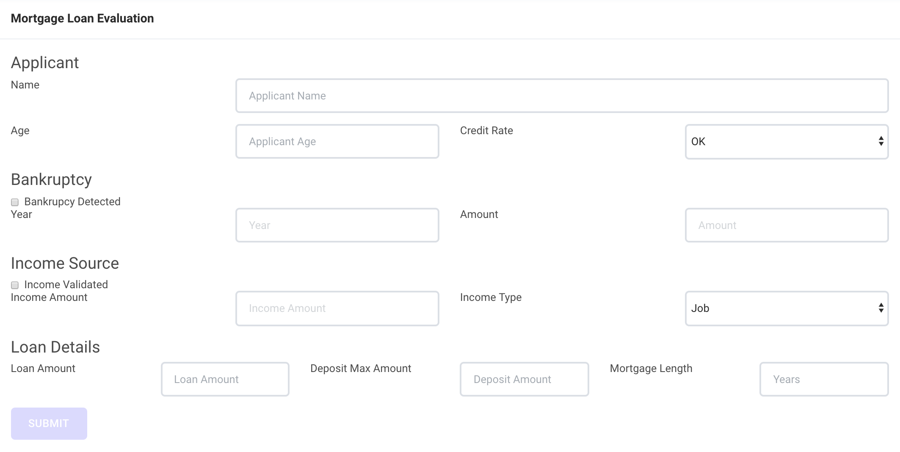

The following describes the fields in the `gpte-ng-dmf` web application:

**Applicant Section**

| Field | Required | Description |
| ----- | -------- | ----------- |
|*Name*| no | Optional name for mortgage loan applicant--not used for any decisions and not persisted anywhere |
|*Age*| yes | Mortgage loan applicant's age--important for some decisions to approve or deny loan |
|*Credit Rate*| yes | Mortgage loan applicant's credit rating |

 **Bankruptcy Section**

| Field              | Required | Description                                                  |
| ------------------ | -------- | ------------------------------------------------------------ |
| *Income Validated* | no       | Check box to indicate income source                          |
| *Income Amount*    | no       | If income source indicated, specify income amount            |
| *Income Type*      | no       | If income source indicated, select either `Job` or `Asset` type |
|                    |          |                                                              |
|                    |          |                                                              |
|                    |          |                                                              |

 **Loan Details Section**

| Field                  | Required | Description                        |
| ---------------------- | -------- | ---------------------------------- |
| **Loan Amount**        | yes      | Requested loan amount              |
| **Deposit Max Amount** | yes      | Initial payment or deposit amount  |
| **Mortgage Length**    | yes      | Requested mortgage length in years |

## Execute Test Cases

In this section, you execute a number of test scenarios:

* An approved mortgage loan application
* A loan application denied because the loan requester is not old enough
* A loan application denied because the loan requester's credit history is not acceptable

### Test Approved Mortgage Loan Application

In this section, you use the following example data to generate an approved response from the engine:

| Field                 | Value               |
| --------------------- | ------------------- |
| *Applicant Name*      | `John Doe`          |
| *Applicant Age*       | 35                  |
| *Credit Rate*         | `AA`                |
| *Bankruptcy Detected* | `False` (unchecked) |
| *Income Validated*    | `True` (checked)    |
| *Income Amount*       | `70000`             |
| *Income Type*         | `Job`               |
| *Loan Amount*         | `25000`             |
| *Deposit Max Amount*  | `1500`              |
| *Mortgage Length* | `20`|

If you do not see the *Mortgage Loan Evaluation* page, select the *Mortgages* option.

1. Enter the example data into the loan evaluation form:

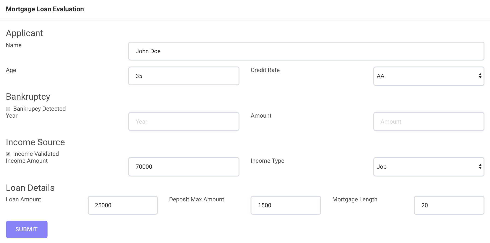

2. Click *Submit*. Expect to see a pop-up dialog indicating that the loan is approved:

3. Click *OK* to dismiss the dialog.

### Test Denied Loan Application Due to Applicant's Age

In this section, you enter loan application data that generates a denied response from the engine. Then you examine the rule that causes the application to be denied.

You use the following example data, where only the applicant's age is different from the previous example data:

| Field                 | Value               |
| --------------------- | ------------------- |
| *Applicant Name*      | `John Doe`          |
| *Applicant Age*       | `15`                |
| *Credit Rate*         | `AA`                |
| *Bankruptcy Detected* | `False` (unchecked) |
| *Income Validated*    | `True` (checked)    |
| *Income Amount*       | `70000`             |
| *Income Type*         | `Job`               |
| *Loan Amount*         | `25000`             |
| *Deposit Max Amount*  | `1500`              |
|*Mortgage Length*| `20`|

1. Update the *Applicant Age* field to `15`, keeping the other data fields the same as the previous example.

2. Click *Submit*. Expect to see a pop-up dialog indicating that the loan is denied:
   

3. Click *OK* to dismiss the dialog.

### Examine Denied Decision Rule

In this section, you find the rule that is making the decision to deny the loan.

1. Log in in to Decision Central.
2. Navigate to the `mortgages` project
3. Search for `underage`. Expect to see results similar to this:

4.  Click the `Underage` asset to open the `Underage.rdrl` file and examine its contents:

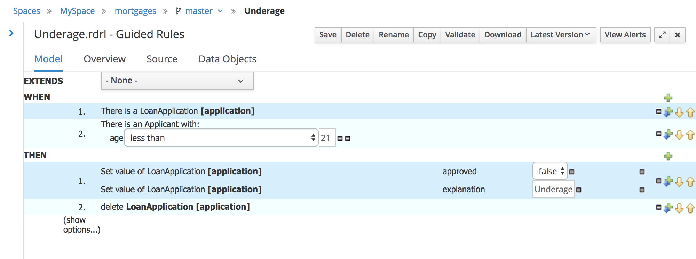

### Test Denied Loan Application Due to Bad Credit History

As in the previous section, you enter loan application data that generates a denied response from the engine. Then you examine the rule that causes the application to be denied.

You use the following example data, changing the applicant's age back to `35` and changing the credit rating from `AA` to `OK`:

| Field                 | Value               |
| --------------------- | ------------------- |
| *Applicant Name*      | `John Doe`          |
| *Applicant Age*       | `35`                |
| *Credit Rate*         | `OK`                |
| *Bankruptcy Detected* | `False` (unchecked) |
| *Income Validated*    | `True` (checked)    |
| *Income Amount*       | `70000`             |
| *Income Type*         | `Job`               |
| *Loan Amount*         | `25000`             |
| *Deposit Max Amount*  | `1500`              |
|*Mortgage Length* | `20`|

1. Return to the `mortgages` web application page.
2. Enter the example data as shown or, if the previous form is still populated, change the applicant's age to `35` and set the credit rating to `OK`.
3. Click *Submit*.
4. Expect to see a pop-up dialog indicating that the loan is denied:

5. Click *OK* to dismiss the dialog.

### Examine Denied Decision Rule

In this section, you find the rule that made the decision to deny the loan.

1. Navigate to the `mortgages` project in Decision Central.
2. Search for `credit check`.
3. Click the `No bad credit checks` asset to open the `No bad credit checks.rdrl` file.
4. Examine the contents of the `No bad credit checks.rdrl` file.