Decision Model & Notation Lab: Advanced
=======================================

This is an advanced Decision Model & Notation lab that introduces DMN Decision Services, Relations, nested boxed expressions, etc. It also explores a number of different FEEL constructs and expressions like, for example, `list contains`.

## Goals

-   Implement a DMN model using the Red Hat DM/PAM DMN editor

-   Deploy the existing DMN project to Decision Server

## Pre reqs

-   Successful completion of the *Environment Setup Lab* or

-   An existing, accessible, DM/PAM 7.3+ environment.

Problem Statement
=================

In this lab we will create a decision that determines if a call-centre can take an incoming call. Whether a call will be accepted by a certain office depends on:

-   The office accepts the call.

-   There are employees currently available at the office.

Whether the office can accepts a call depends on: *whether the phone number has been banned.* the purpose of the phone call ("help" or "objection")

Create a Decision Project
=========================

To define and deploy a DMN decision model, we first need to create a new project in which we can store the model. To create a new project:

1.  Navigate to [Business Central](https://localhost:8080/business-central)

2.  Login to the platform with the provided username and password.

3.  Click on **Design** to navigate to the Design perspective.

    

4.  In the Design perspective, create a new project. If your space is empty, this can be done by clicking on the blue **Add Project** button in the center of the page. If you already have projects in your space, you can click on the blue **Add Project** icon at the top right of the page.

5.  Give the project the name `call-centre-decisions`, and the description "Call Centre Decisions".

    

6.  With the project created, we can now create our DMN model. Click on the blue **Add Asset** button.

7.  In the **Add Asset** page, select **Decision** in the dropdown filter selector.

    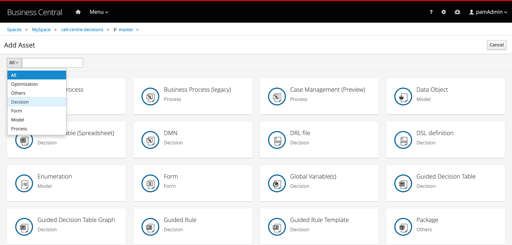

8.  Click on the **DMN** tile to create a new DMN model. Give it the name `call-centre`. This will create the asset and open the DMN editor.

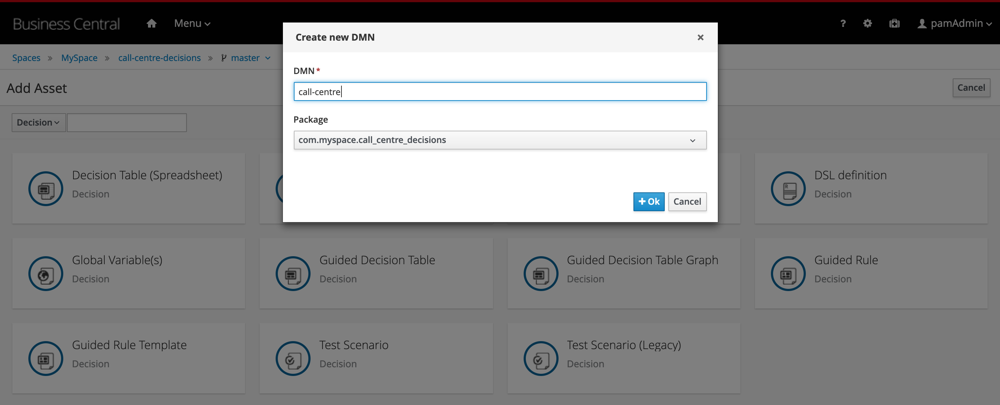

DMN Editor
==========

The DMN Editor consists of a number of components:

-   **Decision Navigator**: shows the nodes used in the Decision Requirements Diagram (DRD, the diagram), and the decisions behind the nodes. Allows for quick navigation through the model.

-   **Decision Requirements Diagram Editor**: the canvas in which the model can be created.

-   **Palette**: Contains all the DMN constructs that can be used in a DRD, e.g. Input Node, Decision Node, etc.

-   **Expression Editor**: Editor in which DMN boxed expressions, like decision tables and literal expressions, can be created.

-   **Property Panel**: provides access to the properties of the model (name, namespace, etc), nodes, etc.

-   **Data Types**: allows the user to define (complex) datatypes.

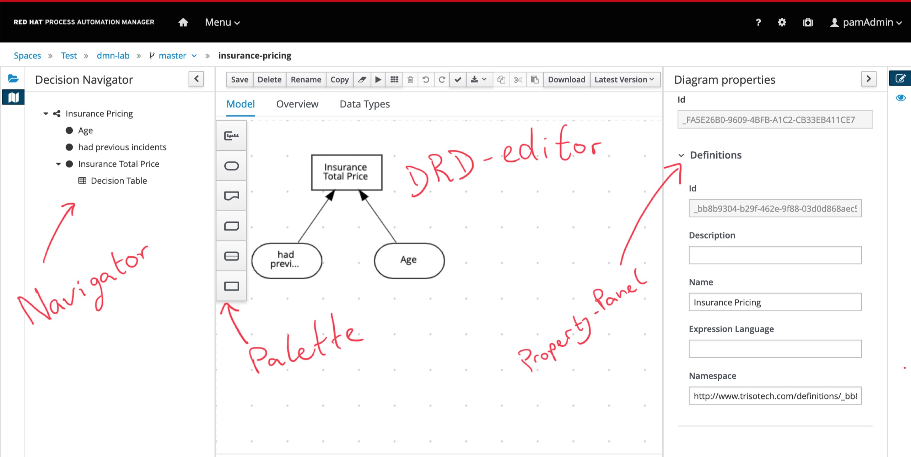

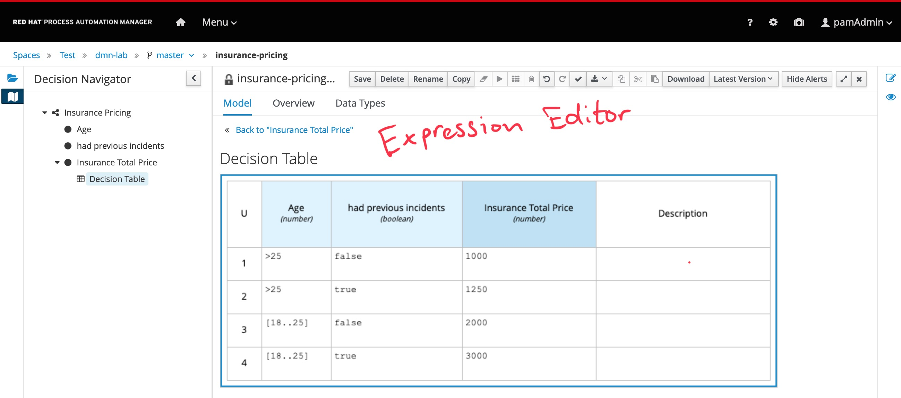

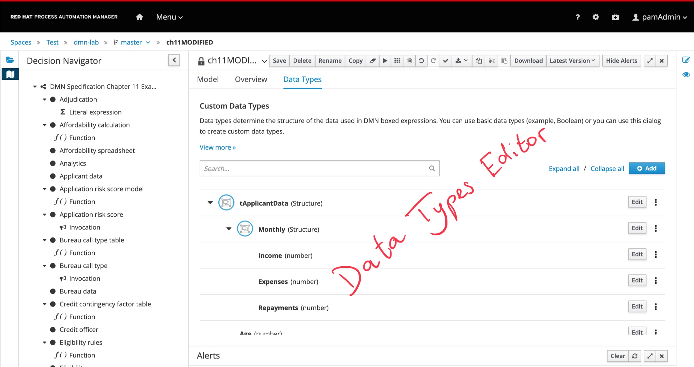

Solution
========

You can do this lab in 2 ways:

1.  If you already have (some) DMN knowledge, we would like to challenge you to build the solution by yourself. After you’ve built solution, you can verify your answer by going to the next module in which we will explain the solution and will deploy it onto the runtime.

2.  Follow this step-by-step guide which will guide you through the implementation.

The Main Decision
=================

The problem statement describes a number of different inputs to our decision:

-   **Call**: the incoming call into the call-centre

-   **Employees**: the employees of certain office.

-   **Office**: an office to which the call could potentially be routed.

Furthermore, the problem statement describes that phone numbers could be banned. So, also **banned numbers** can be regarded as an input to our model (although we will not implement it as an input in this lab).

With the given input, we need to make the following decision:

-   **Accept Call**: the final decision we need to make is whether the given office will accept the call.

    1.  Add a **Decision** node to the diagram by clicking on the **Decision** node icon and placing it in the DRD

    2.  Add an **Input** node to the diagram by clicking on the **Input** node icon and placing it in the DRD.

        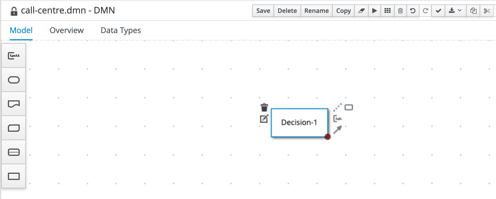

    3.  Double-click on the node to set the name. We will name this node `Accept Call`.

    4.  With the `Accept Call` node selected, open the property panel. Set the **Output data type** to `boolean`.

        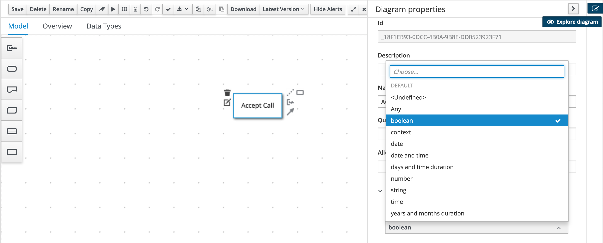

    5.  The input of this decision is the **incoming call**, **office** and **employee**. Create these 3 input nodes and connect them to the **Accept Call** decision.

        

    6.  We can now set data types of our input nodes.

        1.  Click on the `incoming call` node, open the property panel and in the **Output data type** section and click on the **Manage** button. This will open the **Custom Data Types** window.

        2.  In the **Custom Data Types** window, click on the **+ Add** button.

        3.  Define the data tyoe `tPhoneNumber` as follows:

            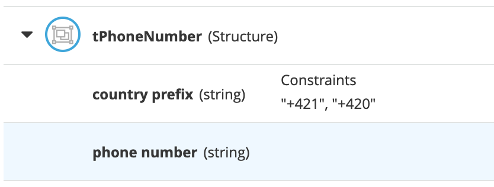

        4.  Define another data type `tCall` as follows. Note that this datatype has a field that is of type `tPhoneNumber`, the type we defined earlier:

            

        5.  When you’ve created the `tCall` type, go back to the DRD by clicking on the **Model** tab.

        6.  Select the `incoming call` node, and in the property panel, set the node’s **Output data type** to `tCall`

            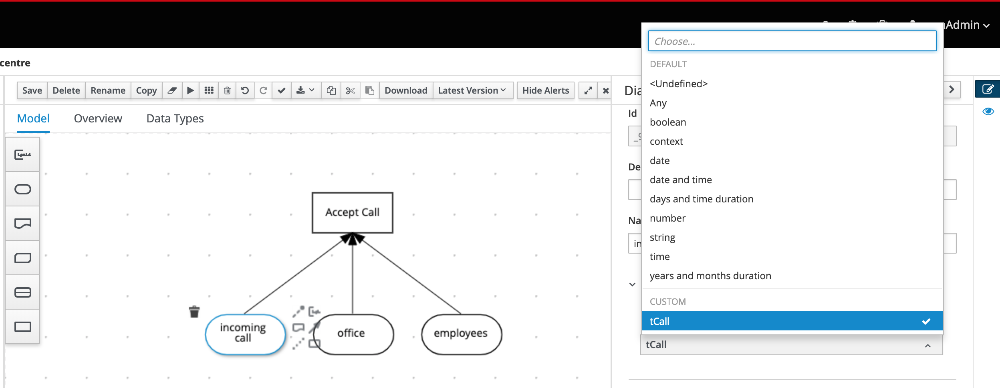

    7.  Next, define the following data type and set it as the **Output data type** of the `office` input as such:

        

    8.  Define the data type for `employees` as follows. Note that we’ve first defined the type `tEmployee`, and afterwards we’ve defined `tEmployees` as a `List` of `tEmployee`.

        

Decision Service
================

With the main structure defined, we can now look at the requirements of the decision whether the office can actually accept the call. As defined in the problem statement, this depends on:

-   whether the phone number has been banned.

-   the purpose of the phone call ("help" or "objection").

We will model this decision as a DMN **Decision Service** that can be called by our main decision `Accept Call`.

1.  First, model the **Decision Service** in the DRD and give it the name `Can Handle Call`. Set it’s **Output data type** to `boolean`.

    

2.  Add a **Decision Node** to the **Decision Service**. Name it `Call Can Be Handled` and set it’s **Output data type** to `boolean`.

    

3.  Add 2 additional **Decision Nodes** and name them `Is Banned` and `Call Purpose Accepted`. Both should have an **Output data type** of type `boolean`.

4.  Connect the 2 **Decision Nodes** to the `Call Can Be Handled` node.

    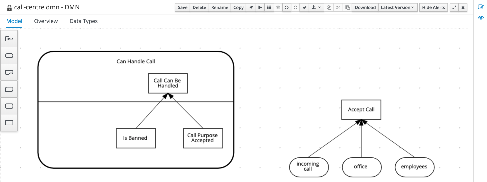

5.  The input to both the `Is Banned` and `Call Purpose Accepted` decisions is a `call`. Create a new **Input** node, name it `call`, set it’s **Output data type** to `tCall` and connect it to the 2 decision nodes.

    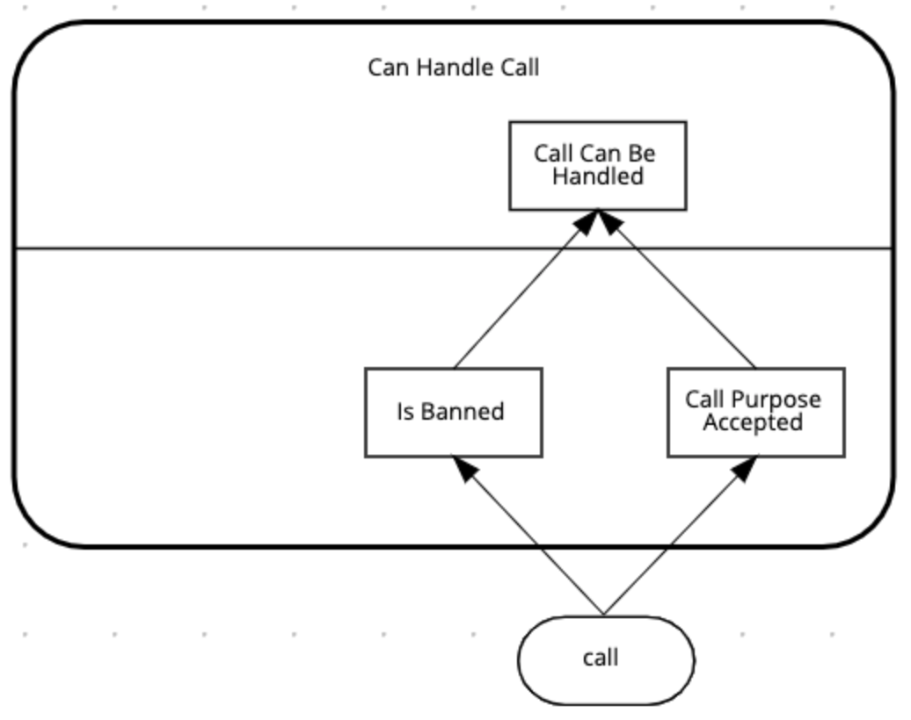

6.  The `Is Banned` decision also needs a collection of banned phone numbers. Instead of implementing this as an **Input** node, we will implement this as a DMN **Relation Decision**.

    1.  Create a new **Decision Node** and name it `Banned Phone Numbers`. Connect it to the `Is Banned` decision node.

        

    2.  The **Ouput data type** of this nodes is a new custom data type, which is a list of `tPhoneNumber`. We’ll name this type `tPhoneNumbers`:

        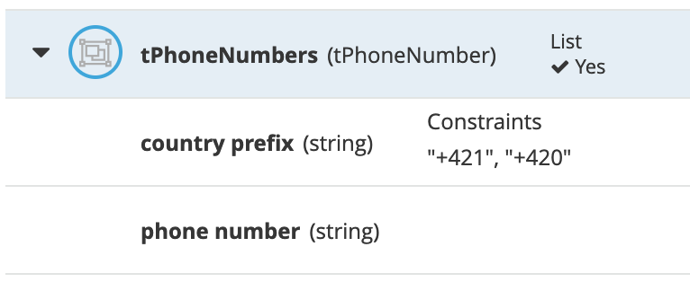

    3.  Click on the **Edit** button of the `Banned Phone Numbers` node. Set the **logic type** of the decision to `Relation`. Create the following table:

        

7.  We can now implement the logic of the `Is Banned` decision. Click on the **Edit** button of the decision node. We will implement the logic as a **Literal Expression**. Define the following FEEL expression:

    ``` list contains(Banned Phone Numbers, call.phone) ```

8.  The next node for which we want to implement the decision logic is `Call Purpose Accepted`. Click on the node, and click on the **Edit** button. Implement the following logic as a **Decision Table**:

    

9.  We can now implement the decision of `Call Can Be Handled`. Click on the node and click on the node’s **Edit** button. In the decision editor, set the **logic type** to **Decision Table** and implement the following table:

    

10. Create a DMN **Knowledge Requirement** from the `Can Handle Call` decision service to the `Accept Call` decision.

    

11. Implement the `Accept Call` decision logic as follows. 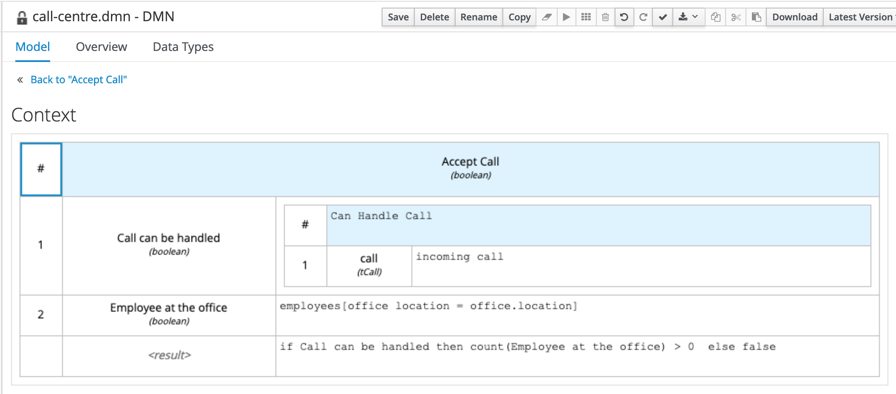

Deploying the Decision Service
==============================

With our decision model completed, we can now package our DMN model in a Deployment Unit (KJAR) and deploy it on the Execution Server. To do this:

1.  In the bread-crumb navigation in the upper-left corner, click on `call-centre -decisions` to go back to the project’s Library View.

2.  Click on the **Deploy** button in the upper-right corner of the screen. This will package our DMN mode in a Deployment Unit (KJAR) and deploy it onto the Execution Server (KIE-Server).

3.  Go to the **Execution Servers** perspective by clicking on "Menu → Deploy → Execution Servers". You will see the **Deployment Unit** deployed on the Execution Server.

Test DMN Solution
=================

In this section, you will test the DMN solution with Execution Server’s Swagger interface.

The Swagger interface provides the description and documentation of the Execution Server’s RESTful API. At the same time, it allows the APIs to be called from the UI. This enables developers and users to quickly test a, in this case, a deployed DMN Service .

1.  Navigate to [KIE Server](https://localhost:8080/kie-server) swagger docs

2.  Locate the **DMN Models** section. The DMN API provides the DMN model as a RESTful resources, which accepts 2 operations:

    1.  `GET`: Retrieves the DMN model.

    2.  `POST`: Evaluates the decisions for a given input.

3.  Expand the `GET` operation by clicking on it.

4.  Click on the **Try it out** button.

5.  Set the **containerId** field to `call-centre-decisions_1.0.0` and set the **Response content type** to `application/json` and click on **Execute** 

6.  If requested, provide the username and password of your **Business Central** and **KIE-Server** user.

7.  The response will be the model-description of your DMN model.

Next, we will evaluate our model with some input data. We need to provide our model with the **age** of an employee and the number of **years of service**. Let’s try a number of different values to test our deicions.

1.  Expand the `POST` operation and click on the **Try it out** button

2.  Set the **containerId** field to `call-centre-decisions_1.0.0-SNAPSHOT`. Set the **Parameter content type** and **Response content type** fields to `application/json`.

3.  Set the **model-namespace** by looking up the namespace of your model in the response/result of the `GET` operation you executed ealier, which returned the model description.

4.  Pass the following request to evaluate whether the given call is accepted by the call-centre.

    We’re explicitly specifying the **decision-name** of the decision we want to evaluate. If we would not specify this, the engine will evaluate the full model, and hence will also require us to pass the `call` input. When we only evaluate the `Accept Call` decision, we only need to specify the inputs of `Accept Call`. In the decision service invocation in the `Accept Call` logic, the input `incoming call` is passed to the `call` parameter of the decision service.

    The namespace of your model is probably different as it is generated. You can lookup the namespace of your model in the response/result of the `GET` operation you executed earlier, which returned the model description.

    ``` json
    { "model-namespace":"https://github.com/kiegroup/drools/kie-dmn/_E5C7F40E-CF45-451C-B3F4-6B0C97A1B131", "model-name":"call-centre", "decision-name": "Accept Call", "decision-id":null, "dmn-context":{ "incoming call":{ "phone": { "country prefix": "+420", "phone number": "1234" }, "purpose": "help" }, "employees": [ { "name": "Duncan", "office location": "Rome" } ], "office": { "location": "Rome" } } } 
    ```
    
    
    
    Click on **Execute**. The result value of the `Accept Call` should be `true`. . Test the service with a number of other values. For example, specify a banned phone number like: +421 92000001

Using the KIE-Server Client
===========================

Red Hat Decision Manager provides a KIE-Server Client API that allows the user to interact with the KIE-Server from a Java client using a higher level API. It abstracts the data marshalling and unmarshalling and the creation and execution of the RESTful commands from the developer, allowing him/her to focus on developing business logic.

In this section we will create a simple Java client for our DMN model.

1.  Create a new Maven Java JAR project in your favourite IDE (e.g. IntelliJ, Eclipse, Visual Studio Code).

2. Add the following dependency to your project:

   ``` xml 
   <dependency> <groupId>org.kie.server</groupId> <artifactId>kie-server-client</artifactId> <version>7.18.0.Final</version> <scope>compile</scope> </dependency> 
   ```

3.  Create a Java package in your `src/main/java` folder with the name `org.kie.dmn.lab`.

4.  In the package you’ve just created, create a Java class called `Main`.

5.  Add a `public static void main(String[] args)` method to your main class.

6. Before we implement our method, we first define a number of constants that we will need when implementing our method (note that the values of your constants can be different depending on your environment, model namespace, etc.):

   ``` java 
   private static final String KIE_SERVER_URL = "http://localhost:8080/kie-server/services/rest/server"; 
   private static final String CONTAINER_ID = "call-centre-decisions_1.0.0"; 
   private static final String USERNAME = "pamAdmin"; 
   private static final String PASSWORD = "redhatpam1!"; private static final String DMN_MODEL_NAMESPACE = "https://github.com/kiegroup/drools/kie-dmn/_D0E62587-C08C-42F3-970B-8595EA48BEEE";
   private static final String DMN_MODEL_NAME = "call-centre";
   ```

7. KIE-Server client API classes can mostly be retrieved from the `KieServicesFactory` class. We first need to create a `KieServicesConfiguration` instance that will hold our credentials and defines how we want our client to communicate with the server:

   ``` java
   KieServicesConfiguration kieServicesConfig = KieServicesFactory.newRestConfiguration(KIE_SERVER_URL, new
   EnteredCredentialsProvider(USERNAME, PASSWORD)); kieServicesConfig.setMarshallingFormat(MarshallingFormat.JSON);
   ```

8. Next, we create the `KieServicesClient`:

   ``` java
   KieServicesClient kieServicesClient = KieServicesFactory.newKieServicesClient(kieServicesConfig);
   ```

9. From this client we retrieve our DMNServicesClient:

   ``` java
   DMNServicesClient dmnServicesClient = kieServicesClient.getServicesClient(DMNServicesClient.class);
   ```

10. To pass the input values to our model to the Execution Server, we need to create a `DMNContext`:

    ``` java
    DMNContext dmnContext = dmnServicesClient.newContext(); 
    ```

11. We pass the input variables to the `DMNContext`. We define the following three methods that create the data inputs:

    ``` java
    private static Map<String, Object> getIncomingCall() { 
      Map<String, Object> incomingCall = new HashMap<>(); 
      Map<String, Object> phone = new HashMap<>(); 
      phone.put("country prefix", "+420"); 
      phone.put("phone number", "1234"); 
      incomingCall.put("phone", phone); 
      incomingCall.put("purpose", "help"); return incomingCall; 
    }
    private static List<Map<String, Object>> getEmployees() {
      List<Map<String,Object>> employees = new ArrayList<>();
      Map<String, Object> employee = new HashMap<>();
      employee.put("name", "Duncan");
      employee.put("office location", "Rome");
      employees.add(employee);
      return employees;
    }
    
    private static Map<String, Object> getOffice() {
      Map<String, Object> office = new HashMap<>();
      office.put("location", "Rome");
      return office;
    }
    ```
    
12. We can now add the data to the `DMNContext` as follows:

    ``` java
    dmnContext.set("incoming call", getIncomingCall()); dmnContext.set("employees", getEmployees()); dmnContext.set("office", getOffice()); 
    ```

13. We now have defined all the required instances needed to send a DMN evaluation request to the server. We explicitly specify which decision we want to evaluate, in this case the `Accept Call` decision, by using the `evaluateDecisionByName` of the `DMNServiceClient`.

    ```java
    ServiceResponse<DMNResult> dmnResultResponse = dmnServicesClient.evaluateDecisionByName(CONTAINER_ID, DMN_MODEL_NAMESPACE, DMN_MODEL_NAME, "Accept Call", dmnContext);
    ```

14. Finally we can retrieve the DMN evaluation result and print it in the console:

    ``` java
    DMNDecisionResult decisionResult = dmnResultResponse.getResult().getDecisionResultByName("Accept Call"); System.out.println("Is the call accepted?: " + decisionResult.getResult()); 
    ```

15. Compile your project and run it. Observe the output in the console, which should say: **Is the call accepted?: true**

The complete project can be found here: <https://github.com/DuncanDoyle/call-centre-dmn-lab-client>
