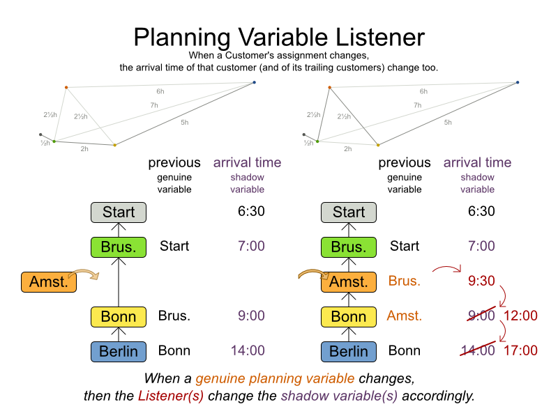
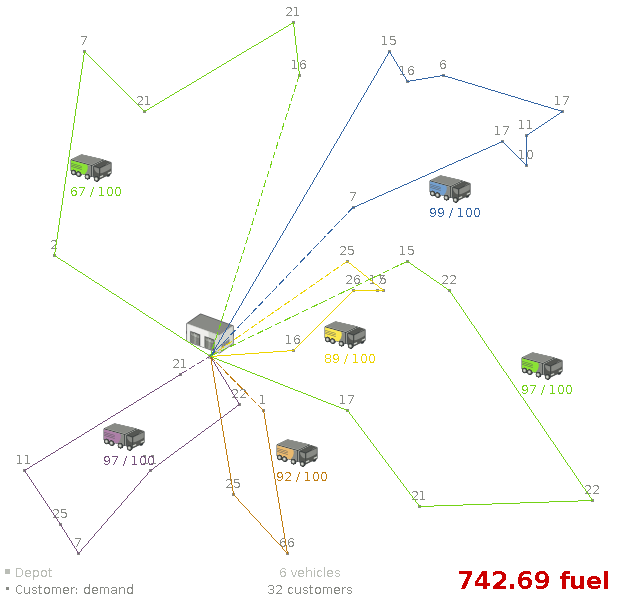
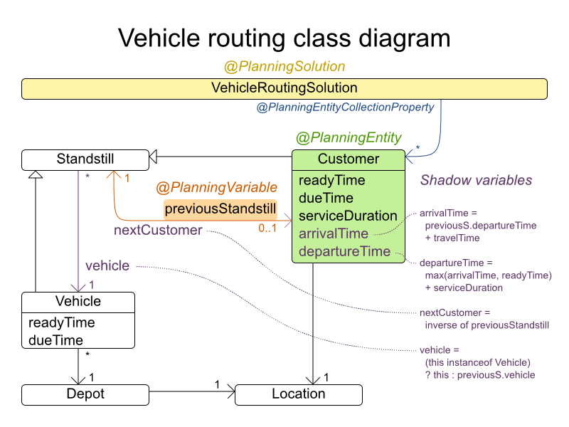
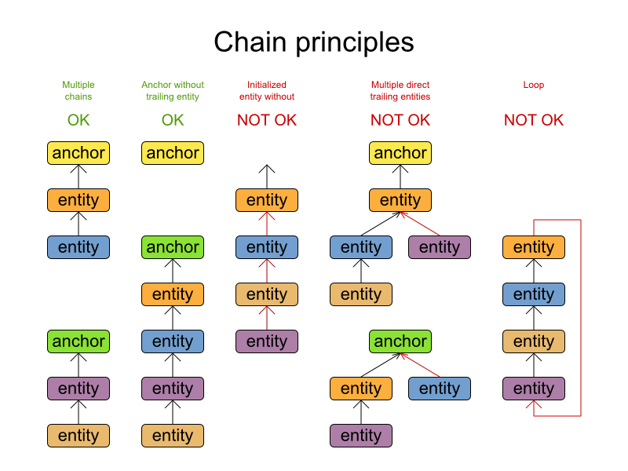
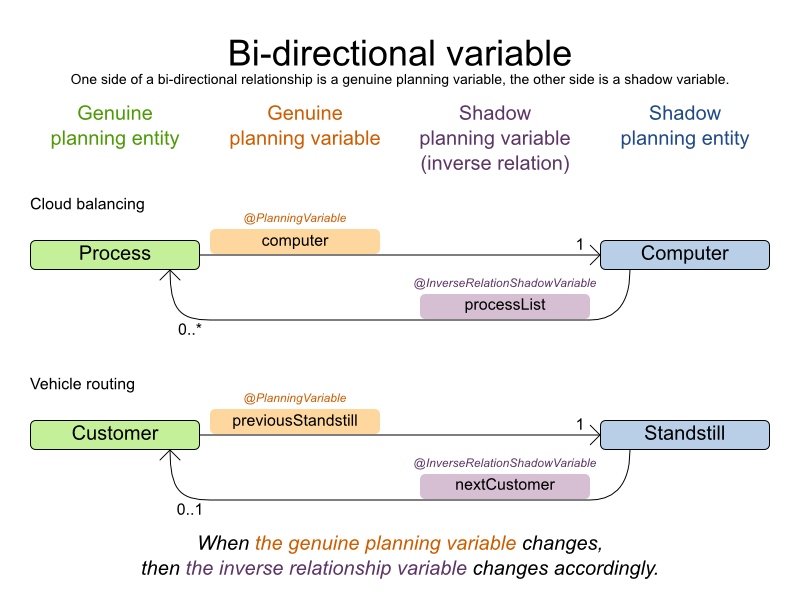

OptaPlanner Shadow Variables Lab
================================

In this lab we will look at an advanced OptaPlanner feature called *Shadow Variables*. A shadow variable is a planning variable whose value can be deduced from the state of the genuine planning variables. Even though such a variable violates the principle of normalization by definition, in some use cases it can be very practical to use a shadow variable, especially to express the constraints more naturally. For example, in vehicle routing with time windows: the arrival time at a customer for a vehicle can be calculated based on the previously visited customers of that vehicle (and the known travel times between two locations).

When the customers for a vehicle change, the arrival time for each customer is automatically adjusted.

In this lab, you will be presented with the *Time Windowed Vehicle Routing Problem*. The full solution to this implementation is already provided, except for the *shadow variable* implementation.

## Goals

-   Understand the concept of *Shadow Variables*.

-   Write a custom *Shadow Variable Listener* for the *Vehicle Routing Problem* that calculates the arrival time at a `Customer`.

-   Use the *Shadow Variable* in constraint rules.

## Pre reqs

-   The project containing the problem.

You will not be presented by the solution’s code and rules in this lab. Instead, as this is a *deep-dive* lab, you’re only presented with the requirements and you’re challenged to come up with the implementation yourself. However, if you get stuck, the lab’s GitHub repository also contains the `optaplanner-training-vehicle-routing-solution` project, which contains the full solution to the lab …. (but please, do not cheat!!).

Problem Statement
=================

The Vehicle Routing Problem (VRP) application deals with scheduling a fleet of vehicles to pick-up objects of each customer and deliver them at the depot. Each vehicle can service multiple customers, but has limited capacity.

In this lab, we will be covering the VRP problem with *time windows* (CVRPWT). The *time windowed* variant adds the concept of time (e.g. due time, service duration) to the problem.

Running the Application
=======================

The repository that contains the base project and the solution cane be found here: <https://github.com/DuncanDoyle/optaplanner-shadow-variables-lab>

1.  Clone the project on your system:

        $ git clone https://github.com/DuncanDoyle/optaplanner-shadow-variables-lab.git

2.  Navigate to the base project.

        $ cd optaplanner-training-vehicle-routing

3.  Build the application with Maven:

        $ mvn clean install

If the build finished successfully, it’s time to import the project in an IDE. You can use your IDE of choice (Eclipse, IntelliJ, Visual Studio Code). In this lab guide, we will use Visual Studio Code.

With the project imported in your IDE, we can explore the application.

The entry-point of the application is the `VehicleRoutingApp` in the package `org.optaplanner.training.vehiclerouting.app`. The `main` method of this class does the following:

1. Creates the `SolverFactory`.
2. Loads the dataset using the `XStreamSolutionFileIO` class.
3. Creates the `Solver`.
4. Starts the `Solver` to solve the problem.
5. Explains the score.
6. Logs the route of one of the `Vehicles` (this is needed to validate our implementation later).
7. Writes the result to an output XML file.

    public static void main(String[] args) {
      SolverFactory<TimeWindowedVehicleRoutingSolution> solverFactory = SolverFactory.createFromXmlResource(SOLVER_CONFIG); // (1)
    
      File inputSolutionFileOne = new File("data/vehiclerouting/unsolved/cvrptw-100customers-A.xml");
      XStreamSolutionFileIO fileIO = new XStreamSolutionFileIO<>(TimeWindowedVehicleRoutingSolution.class);
      TimeWindowedVehicleRoutingSolution problemOne = (TimeWindowedVehicleRoutingSolution) fileIO.read(inputSolutionFileOne);   // (2)
    
      Solver<TimeWindowedVehicleRoutingSolution> solver = solverFactory.buildSolver();   // (3)
    
      TimeWindowedVehicleRoutingSolution solutionOne = solver.solve(problemOne);  // (4)
    
      String scoreExplanation = solver.explainBestScore();  // (5)
      LOGGER.debug("Finished solving. Explaining the score:");
      LOGGER.debug(scoreExplanation);
    
      logFirstChain(solutionOne);  // (6)
    
      File outputSolutionFileOne = new File("data/vehiclerouting/solved/cvrptw-100customers-A.xml");
      fileIO.write(solutionOne, outputSolutionFileOne);  // (7)
    }

Note that we use the `cvrptw-100customers-A.xml` file, which contains a *time windowed* data-set.

The `SolverFactory` is created from the Solver configuration XML file. Let’s open this file and inspect the configuration, and in particular the *termination configuration*:

    <termination>
      <secondsSpentLimit>30</secondsSpentLimit>
      <!--
      <minutesSpentLimit>5</minutesSpentLimit>
      -->
    </termination>

The *termination configuration* shows that our `Solver` will run for 30 seconds.

From the configuration we can also see which file contains our constraint rules:

    <scoreDrl>org/optaplanner/training/vehiclerouting/solver/vehicleRoutingScoreRules.drl</scoreDrl>

We will need this file later when we implement the *hard constraint* that uses our shadow variable.

The Domain Model
================

As we’ve seen in this training, creating a proper domain model for your OptaPlanner application is extremely important. The right `PlanningEntities` and `PlanningVariables` need to be defined, as well as the surrounding classed of the domain, to be able to build a performant, manageable and maintainable OptaPlanner application that is able to solve the exact problem of the given domain.

The domain model of our Vehicle Routing application is defined as follows:

The `PlanningSolution` class is `VehicleRoutingSolution`. Because we use the *time windowed* variant of the VRP, our `PlanningSolution` class is actually `TimeWindowedVehicleRoutingSolution` in the package `org.optaplanner.training.vehiclerouting.domain.timewindowed`.

The domain model shows that we have a single `PlanningEntity`. Again, because we use the *time windowed* variant of the VRP, our `PlanningEntity` class is actually `TimeWindowedCustomer` in the package.

The `PlanningVariable` is the `previousStandstill` property of our `Customer`. The domain model is a bit odd, as a `Standstill` can either be a `Customer` (the previous customer that was visited), or a `Vehicle`. This is due to the fact that we’re dealing with *Chained Planning Variables*.

In our vehicle routing chain, the *anchor* of our chain is the `Vehicle` and the *entities* are the `Customers` that we visit.

Shadow Variables
================

As stated earlier, a *Shadow Variable* is a variable whose value can be deduced from the state of genuine planning variables.

As genuine planning variables constantly change during solving, shadow variables need to be changed accordingly when their *source planning variable* changes.

> **INFO:** Any class that has at least one shadow variable, is a planning entity class (even if it has no genuine planning variables). That class must be defined in the solver configuration (unless classes are automatically scanned) and have a @PlanningEntity annotation.

> **INFO:** A genuine planning entity class has at least one genuine planning variable, but can have shadow variables too. A shadow planning entity class has no genuine planning variables and at least one shadow planning variable.

OptaPlanner has a number of built-in shadow variables, like the *Bi-Directional Shadow Variable*, which is configured using the `@InverseRelationShadowVariable`:

Another built-in shadow variable is the *Anchor Shadow Variable*. which is used in chained variables. This shadow variable is annotated with the `@AnchorShadowVariable`. An example can be seen in the `getVehicle` method of the `Customer` class of our Vehicle Routing application.

Apart from the built-in shadow variables, OptaPlanner also supports custom shadow variables. These are, for example, required when deducing the shadow variable from the genuine planning variables requires some form of calculation, aggregation, etc., like in our arrival time use-case. A custom shadow variable is implememented as a `VariableListener`.

> **INFO:**  If the source variable’s class is different than the shadow variable’s class, also specify the entityClass in the @PlanningVariableReference annotation and make sure the shadow variable’s class is registered as a planning entity, otherwise Planner won’t detect it and the shadow variable won’t update.

> **IMPORTANT:** A VariableListener can only change shadow variables. It must never change a genuine planning variable or a problem fact.

> **IMPORTANT:** Any change of a shadow variable must be told to the ScoreDirector.

In this lab, we want to write a constraint that determines whether a `Customer` is visited on time. We want to know whether the `arrivalTime` at a `Customer` is before the `dueTime`. If this is **not** the case, this is a *hard constraint* violation.

To be able to implement this rule, we need to have access to the `arrivalTime`. The `arrivalTime` of a `Customer` changes during solving, as the `PlanningVariables`, i.e. the `Customer` `previousStandStill` changes. Hence, we need a *shadow variable listener* that updates the `Customer` `arrivalTime` when it’s `previousStandstill` changes.

Let’s first look at the shadow variable configuration.

1.  Open the `TimeWindowedCustomer` class.

2.  Navigate to the method `getArrivalTime`. This method is annotated with the annotation `@CustomShadowVariable`:

        @CustomShadowVariable(variableListenerClass = ArrivalTimeUpdatingVariableListener.class, // (1)
                            sources = {@PlanningVariableReference(variableName = "previousStandstill")}) // (2)

    -   The `variableListenerClass` is the class `ArrivalTimeUpdatingVariableListener`.

    -   The `source` of this *shadow variable* is the `previousStandstill` planning variable.

3.  Open the `ArrivalTimeUpdateVariableListener` class in the package `org.optaplanner.training.vehiclerouting.domain.timewindowed.solver`. Note that the `updateArrivalTime` and `calculateArrivalTime` are empty. It’s your task in this lab to implement these methods.

We can see that the *arrivalTime* is not yet calculated. Let’s run the application first, and observe the output of one of the routes of a `Vehicle`.

1.  Open the `VehicleRoutingApp` class.

2.  Run the `main` method.

3.  If everything works correctly, you will see one of the routes of a `Vehicle` logged:

        18:35:00.161 [main        ] DEBUG Chain of vehicle: 0
        - Customer: AirLocation-95,       arrivalTime: null,     dueTime: 49000
        - Customer: AirLocation-59,       arrivalTime: null,     dueTime: 28000
        - Customer: AirLocation-93,       arrivalTime: null,     dueTime: 198000
        - Customer: AirLocation-85,       arrivalTime: null,     dueTime: 101000
        - Customer: AirLocation-37,       arrivalTime: null,     dueTime: 144000
        - Customer: AirLocation-91,       arrivalTime: null,     dueTime: 170000
        - Customer: AirLocation-100,    arrivalTime: null,       dueTime: 195000
        - Customer: AirLocation-98,       arrivalTime: null,     dueTime: 68000
        - Customer: AirLocation-92,       arrivalTime: null,     dueTime: 28000
        - Customer: AirLocation-97,       arrivalTime: null,     dueTime: 143000
        - Customer: AirLocation-94,       arrivalTime: null,     dueTime: 110000

4.  We can see that the `arrivalTime` is null, as we’ve not implemented any logic (shadow variable listener) yet which keeps track of this value.

It’s now time to implement our custom shadow variable listener that will update the arrivalTime of our `Customer` entities.

The `getArrivalTime` method of our `Customer` class is already properly annotated. We only need to implement the `ArrivalTimeUpdateVariableListener` listener

1.  Open the `ArrivalTimeUpdateVariableListener` and navigate to the method `updateArrivalTime`. Note that this method is called in the `afterEntityAdded` and `afterVariableChanged` methods of our Listener.

2.  Observe that in these methods, we can access the `ScoreDirector` and the `Customer`.

3.  To be able to calculate the `arrivalTime` of this `Customer`, implement the following semantics:

    1.  Find out what the `previousStandStill` is.

    2.  Determine the `departureTime` of the `previousStandstill`. If the `previousStandstill` is a `Customer`, then this is the `departureTime` of the `Customer`. If the `previousStandstill` is a `Vehicle` (the *anchor* of the chain), the `departureTime` is the `readyTime` of the `TimeWindowedDepot` of the `Vehicle`.

    3.  From the `departureTime` of the `previousStandstill`, and the `getDistanceFromPreviousStandstill` method of the `Customer` class, we can calculate the `arrivalTime`. We do this in the `calculateArrivalTime` method. Note that if the `previousStandstill` of the `Customer` is a `Vehicle`, the `arrivalTime` at the customer is either the `readyTime` of the `Customer`, or the sum of `previousDepartureTime` and the `distanceFromPreviousStandstill` of the `Customer`.

    4.  Finally, we can update the `arrivalTime`. We need to make sure that we not only update the `arrivalTime` of the current `Customer`, but also of the next `Customers` in the chain. Note that for the next `Customer` in the chain, we can calculate its `arrivalTime` using the `calculateArrivalTime` method.

        When updating a shadow variable, the `ScoreDirector` needs to be informed of the update. Hence, the update logic needs to be wrapped in a `ScoreDirector.beforeVariableChanged` and `ScoreDirector.afterVariableChanged` method call, like so:

            scoreDirector.beforeVariableChanged(shadowCustomer, "arrivalTime");
            shadowCustomer.setArrivalTime(arrivalTime);
            scoreDirector.afterVariableChanged(shadowCustomer, "arrivalTime");

OptaPlanner can be configured to run in, so called, `FULL_ASSERT` mode. In this mode, the engine executes a lot of additional checks to verify whether you’ve implemented your application correctly. For example, OptaPlanner will check that there is no score corruption when doing incremental score calculation. This is an extremely useful feature to validate whether you’ve implemented your constraint rules, shadowvariables, move filters, etc., correctly.

1.  Open the solver configuration XML file. Add the following line, directly under the `<solver>` element:

        <environmentMode>FULL_ASSERT</environmentMode>

2.  With the shadow variable listener implemented and the `environmentMode` set to `FULL_ASSERT`, build the application and run the `VehicleRoutingApp`.

3.  If you’ve implemented your shadow variable correctly, you should now see the `arrivalTime` in the logged route:

        19:11:03.485 [main        ] DEBUG Chain of vehicle: 0
        - Customer: AirLocation-52,      arrivalTime: 52000,     dueTime: 62000
        - Customer: AirLocation-82,      arrivalTime: 74649,     dueTime: 65000
        - Customer: AirLocation-48,      arrivalTime: 90034,     dueTime: 175000
        - Customer: AirLocation-47,      arrivalTime: 181403,    dueTime: 61000
        - Customer: AirLocation-19,      arrivalTime: 199465,    dueTime: 86000
        - Customer: AirLocation-11,      arrivalTime: 216536,    dueTime: 77000
        - Customer: AirLocation-62,      arrivalTime: 234598,    dueTime: 68000
        - Customer: AirLocation-31,      arrivalTime: 253818,    dueTime: 60000
        - Customer: AirLocation-88,      arrivalTime: 268818,    dueTime: 84000
        - Customer: AirLocation-7,       arrivalTime: 285143,    dueTime: 91000
        - Customer: AirLocation-18,      arrivalTime: 305143,    dueTime: 97000

Note that, in our current application, the `arrivalTime` sometimes is **after** the `dueDate`. We’re clearly missing a constraint rule.

The Constraint Rules
====================

The constraint rules can be found in the file `vehicleRoutingScoreRules.drl` in the package `org.optaplanner.training.vehiclerouting.solver`. We now need to implement the rule that penalizes being late at a `Customer` with a *hard constraint*. I.e. we need to penalize when the `arrivalDate` of a `Customer` is **after** the `dueDate`.

1.  Open the constraint rule file `org/optaplanner/training/vehiclerouting/solver/vehicleRoutingScoreRules.drl`.

2.  Navigate to the end of the file.

3.  Add a constraint rule. Name it `arrivalAfterDueTime`:

        rule "arrivalAfterDueTime"
        when
        
        then
        
        end

4.  Implement the logic that penalizes being late with a *hard constraint*.

5.  Compile and run the application again. If you’ve implemented the rule correctly, you can see that the constraint is no longer violated.

        19:28:02.335 [main        ] DEBUG Chain of vehicle: 2
        - Customer: AirLocation-92,      arrivalTime: 18385,     dueTime: 28000
        - Customer: AirLocation-98,      arrivalTime: 31547,     dueTime: 68000
        - Customer: AirLocation-61,      arrivalTime: 75616,     dueTime: 86000
        - Customer: AirLocation-85,      arrivalTime: 90472,     dueTime: 101000
        - Customer: AirLocation-96,      arrivalTime: 108810,    dueTime: 145000

Conclusion
==========

In this lab we’ve seen how we can use *Shadow Variables* to keep track of and/or deduce values of variables from the state of genuine planning variables. We’ve implemented a custom shadow variable listener that keeps track of the `arrivalTime` at a `Customer` by calculating the `arrivalTime` from the previous `Customer` `departureTime` and the `distance` between the current `Customer` and the previous `Customer`. Finally, we’ve implemented a rule that uses this shadow variable in a hard constraint.
