Decisions and AI: Combining DMN with PMML Lab
=============================================

This is an advanced Decision Model & Notation lab that combines declarative decisions with predictive A.I. decisions. This is done by combining DMN models with AI/ML models defined in PMML (Predictive Model Markup Language).

## Goals

-   Implement a DMN model using the Red Hat DM/PAM DMN editor

-   Import PMML models into a DMN model.

-   Use PMML model as the knowledge source for a DMN Business Knowledge Model (BKM) node

-   Invoke a BKM backed by a PMML model from a DMN Decision node.

-   Use predictive decision results in declarative decisions.

## Pre Reqs

-   Successful completion of the *Environment Setup Lab* or

-   An existing, accessible, DM/PAM 7.5+ environment.

Problem Statement
=================

In this lab we will create a decision that determines whether a credit card dispute is eligible for automatic approval. Whether a dispute is accepted for automatic approval depends on:

-   The risk of the dispute

-   The risk of the cardholder.

Both risk scores will be combined in a DMN FEEL expression and when the sum of the risks is lower than a certain threshold, the dispute will be automatically accepted.

Adding jPMML Support to Process Automation Manager
==================================================

In order to work with our PMML models, both in Business Central and KIE-Server, we need to add PMML support to the platform. RHPAM has 2 runtimes that provide PMML support:

-   [KIE-PMML](https://github.com/kiegroup/drools/tree/master/kie-pmml): The PMML implemenation of the KIE project. Currently only supports a small set of models.

-   [jPMML](https://github.com/jpmml): The PMML Java reference implementation. Provides support for almost the full PMML v4.3 specification.

In this lab we will be working with the *jPMML* implementation. This implementation is [AGPL](https://en.wikipedia.org/wiki/Affero_General_Public_License) licensed. This implies that we cannot ship the *jPMML* libraries with our product. We therefore need to add these libraries, and the library that links *jPMML* to our KIE DMN runtime, to our Red Hat Process Automation Manager installation.

1.  Download the following 3 files (use exactly version *1.4.9* of the *jPMML* evaluator. RHPAM is not (yet) compatible with later versions):

    1.  [kie-dmn-jpmml-7.27.0.Final.jar](https://search.maven.org/remotecontent?filepath=org/kie/kie-dmn-jpmml/7.27.0.Final/kie-dmn-jpmml-7.27.0.Final.jar)

    2.  [pmml-evaluator-1.4.9.jar](https://search.maven.org/remotecontent?filepath=org/jpmml/pmml-evaluator/1.4.9/pmml-evaluator-1.4.9.jar)

    3.  [pmml-evaluator-extension-1.4.9.jar](https://search.maven.org/remotecontent?filepath=org/jpmml/pmml-evaluator-extension/1.4.9/pmml-evaluator-extension-1.4.9.jar)

2.  Add these 3 files to Business Central by adding them to the `business-central.war/WEB-INF/lib` directory of your BC instance.

3.  Add these 3 files to KIE-Server by adding them to the `kie-server.war/WEB-INF/lib` directory of your KIE-Server instance.

4.  Restart your RHPAM environment.

When you want to use *jPMML* in an OpenShift based installation of RHPAM, you need to build a custom image of Business Central and KIE-Server. Example Docker files can be found [here](https://github.com/DuncanDoyle/ansible_agnostic_deployer/tree/dmn-pmml-demo/ansible/roles/ocp-workload-pam7-cc-dispute-dmn-pmml/files/rhpam_openshift_dmn_pmml).

Import the Lab project
======================

In this lab we will use PMML models as the decision implementation of DMN Business Knowledge Models nodes. We’ve provided these PMML models, and our initial DMN model in the following [GitHub project](https://github.com/rhba-enablement/rhpam75-dmn-pmml-lab).

1.  Navigate to [Business Central](https://localhost:8080/business-central)

2.  Login to the platform with the provided username and password.

3.  Click on **Design** to navigate to the Design perspective.

    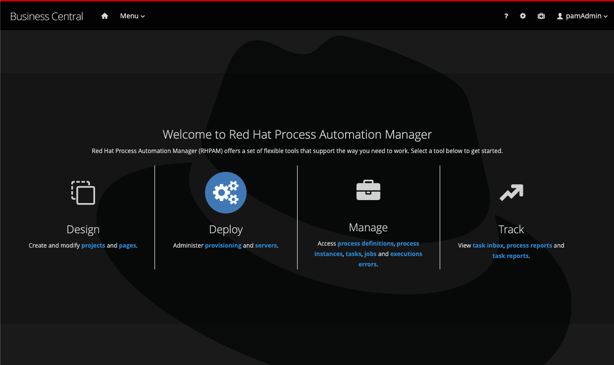

4.  Click on the `MySpace` tile to open the space.

5.  In the Design perspective, import the lab project from GitHub. If your space is empty, this can be done by clicking on the **Import Project** button in the center of the page. If you already have projects in your space, you can click on the kebab menu in the upper right corner of the screen and select **Import Project**.

6.  In the **Import Project** window, enter the following `Repository URL` and click on the blue **Import** button: <https://github.com/rhba-enablement/rhpam75-dmn-pmml-lab>

    

7.  In the **Import Projects** screen, select the `rhpam75-dmn-pmml-lab` tile and click on the blue **Ok** button in the upper right corner of the window.

    

8.  With the project imported, we can now inspect the assets. Our project has 5 assets:

    1.  A DMN model which contains the decision to classify a credit card dispute to be eligible for automated processing.

    2.  A PMML model for Cardholder Risk Rating using [Linear Regression](https://en.wikipedia.org/wiki/Linear_regression).

    3.  A PMML model for Dispute Risk Rating using [Linear Regression](https://en.wikipedia.org/wiki/Linear_regression).

    4.  A PMML model for Cardholder Risk Rating using [Random Forest](https://en.wikipedia.org/wiki/Random_forest).

    5.  A PMML model for Dispute Risk Rating using [Random Forest](https://en.wikipedia.org/wiki/Random_forest).

        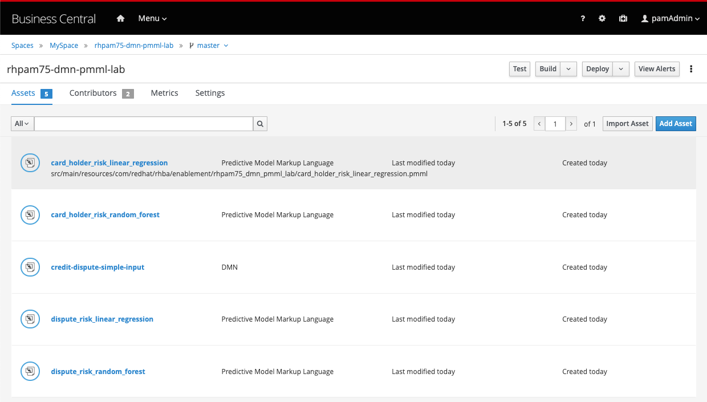

9.  Open the DMN file. Make a copy of the file by clicking on the **Copy** button in the toolbar of the editor. Name the copy `credit-dispute-simple-input-pmml1`.

10. Go back to the **Asset Library** view by clicking on the `rhpam75-dmn-pmml-lab` project name in the breadcrumb navigation at the top left of the screen.

11. Open the `credit-dispute-simple-input-pmml1` DMN file.

Let’s first observe the DMN model.

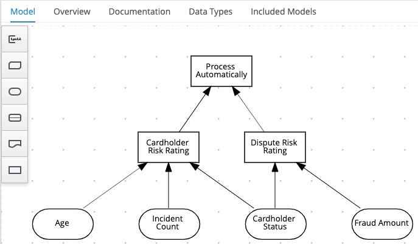

We can identify 4 input values:

-   Age: number

-   Incident Count: number

-   Cardholder Status: string

-   Fraud Amount: number

Next, we see 2 **Decision Nodes**:

-   Cardholder Risk Rating

-   Dispute Risk Rating

The decision logic of both of these nodes is implemented by a **Decision Table**. We can view the decision logic by selecting a decision node and clicking on the **Edit** icon:

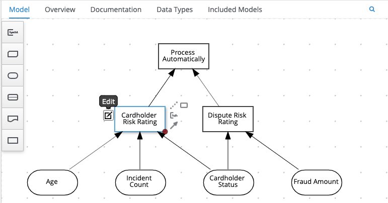

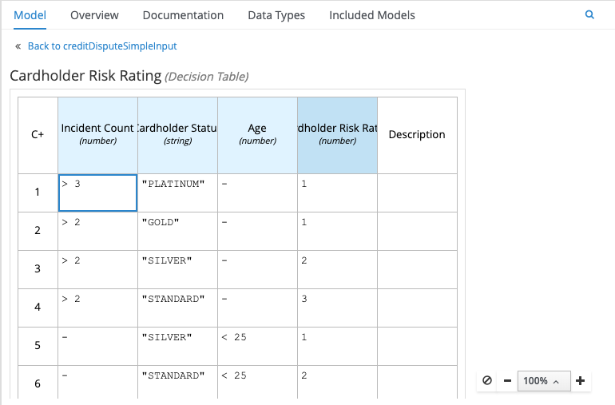

The last **Decision Node** is the `Process Automatically` decision. The decision logic of this node is implemented as FEEL expression that simply takes the output of the other 2 decision nodes and checks whether their sum is lower than 5. When this is the case, the `Process Automatically` node will return `true`

``` 
(Cardholder Risk Rating + Dispute Risk Rating) < 5
```

We now need to rename our model. Since we now have 2 DMN models in our project, we need to make sure that their names are not equal.

1.  Click anywhere in the DMN model canvas to select the model.

2.  Open the properties panel on the right-hand-side of the screen.

3.  Rename the model from `creditDisputeSimpleInput` to `creditDisputeSimpleInputPmml1`.

4.  Save the model.

Importing PMML models
=====================

In this lab we will replace the decision logic of our 2 *Risk Rating* decisions with a predictive model. I.e. we will move from declaratively defined decisions to predicted decisions.

In order to use our predictive models as a knowledge source in our DMN model, we first need to import our PMML models in our DMN model.

1.  Open the `credit-dispute-simple-input-pmml1` DMN model.

2.  Click on the **Included Models** tab.

    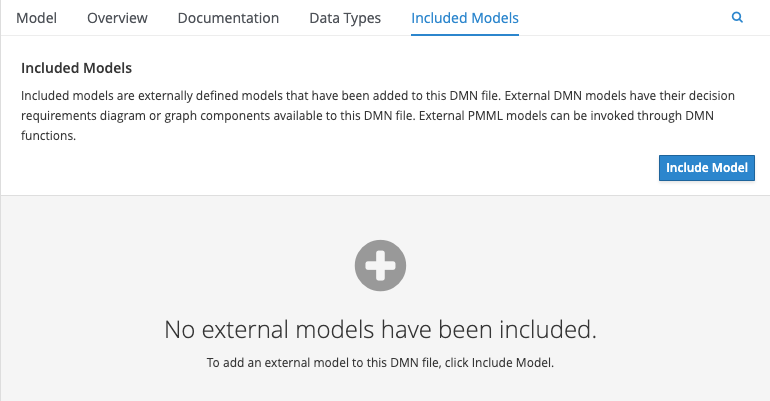

3.  Click on the blue **Include Model** button, select the `card_holder_risk_linear_regression.pmml` model, provide the name `card-holder-risk-linear` and click **Include**.

    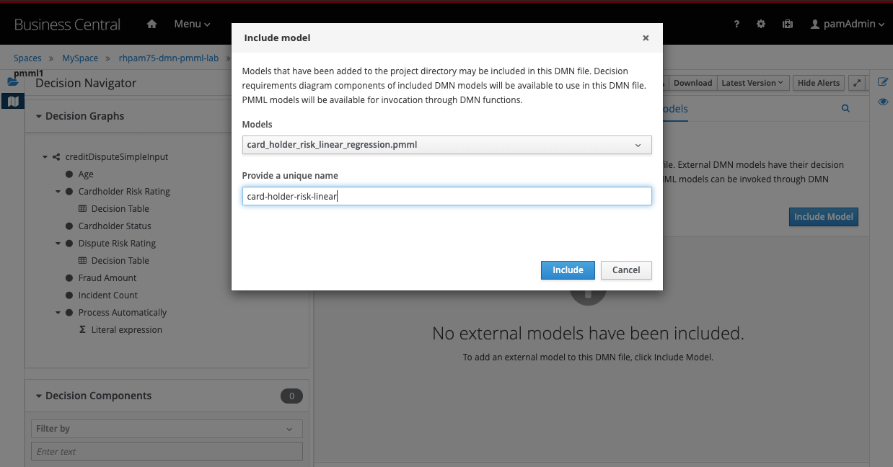

4.  Do the same for the `dispute_risk_linear_regression.pmml` model. Give it the name `dispute-risk-linear`.

5.  Save the DMN file.

With the PMML files included we can now start implementing our logic

1.  Add a new **Business Knowledge Model** node to the DMN model. Give it the name `Dispute Risk Model` and connect it to the `Dispute Risk Rating` **Decision Node**.

    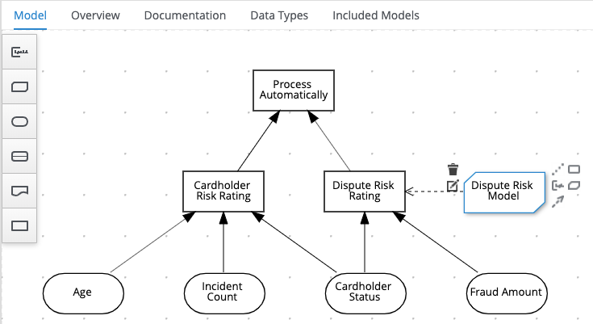

2.  Click on the **Edit** button of the new `Dispute Risk Model` node. In the editor, click on the cell with the `F`. In the **Selection Function Kind** dropdown box, select `PMML`.

    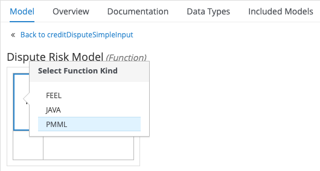

3.  Double-click in the cell that says "*First select PMML document*". Select the `dispute-risk-linear` document.

4.  Double-click in the cell that says "*Second select PMML model*". Because a PMML document can contain multiple models, we need to select which model we want to use. Since our document only contains a single model, we simply select that model: `LinearRegression`.

5.  Observe that the editor inspects the model and shows the model’s input parameters, i.e. `amount` and `holder_index`.

    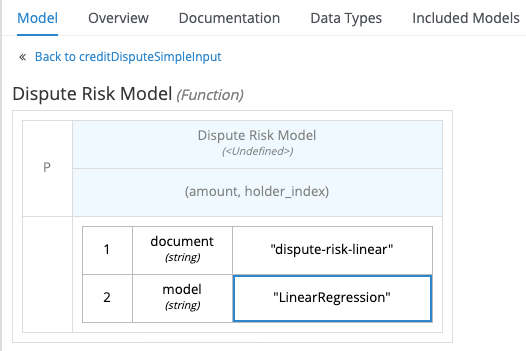

6.  Save the model and go back to the diagram (DRD) by clicking on the **Back to creditDisputeSimpleInput** breadcrumb.

7.  Do the same for `Cardholder Risk Rating` decision.

    1.  Add a BKM and give it the name `Cardholder Risk Model`.

    2.  Connect the BKM to the **Decision Node**.

    3.  Configure the BKM to use the Cardholder Risk Linear Regression model.

With our PMML models imported and our **Business Knowledge Model** nodes created, it’s now time to alter the decision logic of the **Decision Nodes** to call the PMML model.

1.  Click on the `Dispute Risk Rating` node and click on the **Edit** button.

2.  Click on the outer edge of the decision table, right-click and select "*Clear*" to clear the decision logic.

3.  Click on "*Select expression*" and select `Context`.

    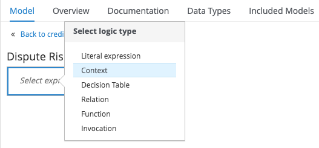

4.  Implement the decision logic as shown in the following image:

    1.  *holder_index_decoded*: implemented as a *Decision Table*, with *Hit Policy* set to `First`, that defines a mapping from a string (the cardholder status) to an integer, as the PMML model expects an integer input value.

    2.  *result*: implemented as an *Invocation* that calls the *Dispute Risk Model* (our BKM) with the parameters `amount` and `holder_index`.

    3.  The final *<result>* is the `result.predicted_dispute_risk` value, which is the output of our PMML model.

        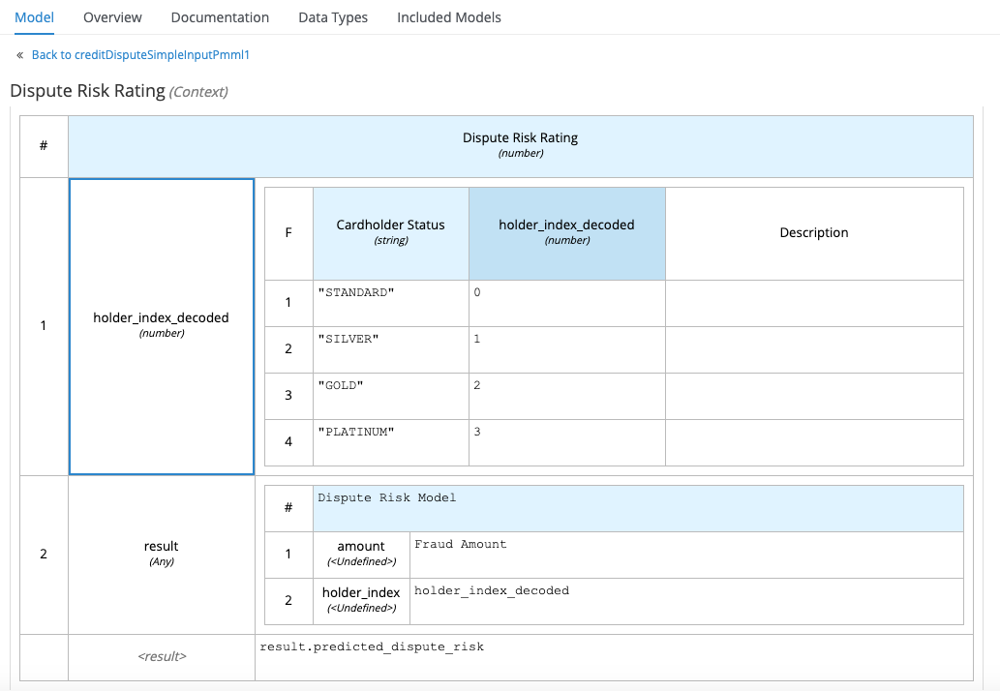

5.  The following video shows the implementation of this decision logic: <https://drive.google.com/file/d/1xmmfMpPAP5Byfe6TMA4-ngHmoBpf8ATB/view?usp=sharing>

We can now implement the decision logic for the `Cardholder Risk Rating` **Decision Node** in the same way we implemented `Dispute Risk Rating` logic.

1.  Click on the `Cardholder Risk Rating` node and click on the **Edit** button.

2.  Click on the outer edge of the decision table, right-click and select "*Clear*" to clear the decision logic.

3.  Click on "*Select expression*" and select `Context`.

4.  Implement the decision logic as shown in the following image:

    1.  *holder_index_decoded*: implemented as a *Decision Table*, with *Hit Policy* set to `First`, that defines a mapping from a string (the cardholder status) to an integer, as the PMML model expects an integer input value.

    2.  *result*: implemented as an *Invocation* that calls the *Cardholder Risk Model* (our BKM) with the parameters `age`, `holder_index`, and `incidents`.

    3.  The final *&lt;result>* is the `result.predicted_holder_risk` value, which is the output of our PMML model.

        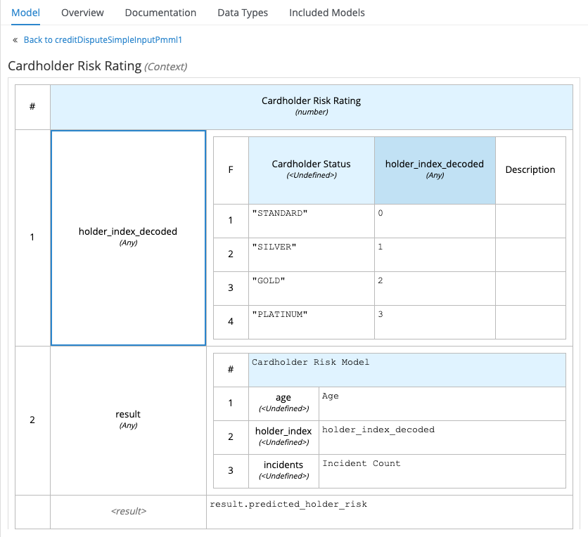

5.  The following video shows the implementation of this decision logic: <https://drive.google.com/file/d/1VqBe8ERZ1Q1CnFeX7BldMT8eY_EZLVP6/view?usp=sharing>

6.  Save the model.

Testing the Model
=================

As our predictive models are invoked through DMN, and our decisions have been implemented as DMN Decision Nodes, we can test our predictive models with the standard RHPAM *Test Scenario Tooling*.

1.  Go back to the Asset Library view of your project.

    

2.  Click on the blue **Add Asset** button in the top right corner.

3.  In the filter input field, type the word `test` to filter out the *Test Scenario* asset types.

    

4.  Click on the `Test Scenario` tile. Name the *Test Scenario* `dmn-pmml1-tests`, set the *Source Type* to `DMN` and select the `credit-dispute-simple-input-pmml1.dmn` as the *DMN asset*.

    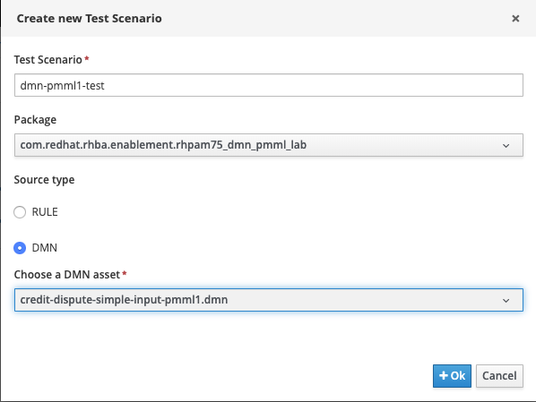

5.  Note how the *Test Scenario* automatically creates the test table with a *Given* column for every **Input Node** of our DMN model, as well an *Expect* column for every decision of the model.

    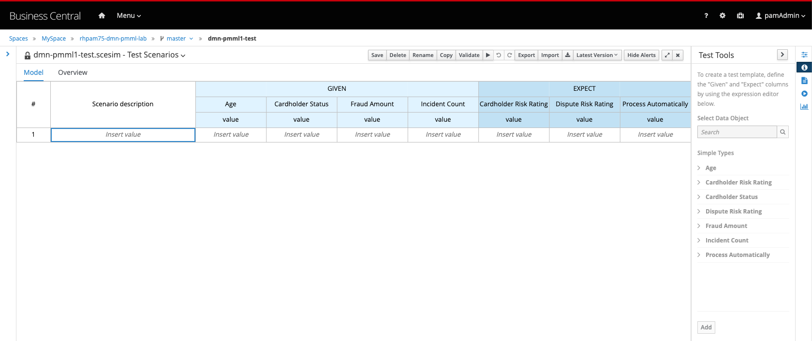

6.  Insert the following values in row 1 of the table (the expected results are deliberately incorrect).

    

7.  Click on the **Play** button in the toolbar of the editor. A test report will appear stating that the test failed.

    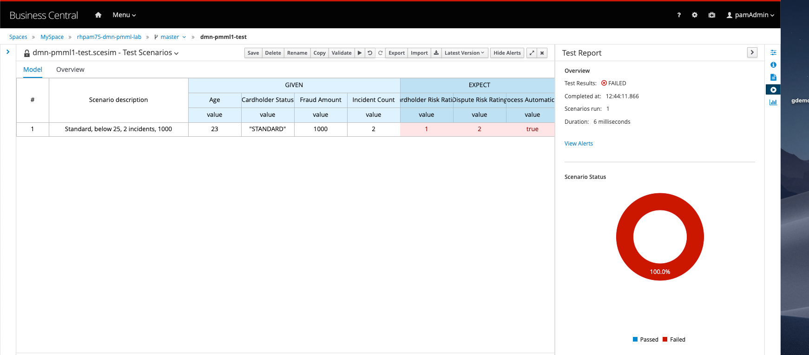

8.  Hover over the `Cardholder Risk Rating` expected result cell. Observe that the tooling shows the actual result of the test and gives you the option to apply the actual result to the cell.

    

9.  The actual value is a floating point number and not an integer. This value is provided by the *Cardholder Risk* Linear Regression PMML model. As our model might be retrained, the actual output of the model might change as well. Hence, we don’t want to apply this exact value to the cell. Instead, we want the test to verify whether the output of our model is within an expected range for this test. Add the following expected value to the cell: `> 1, < 2` and run the test again.

10. We can see that the expected value for the `Cardholder Risk Rating` is now correct.

    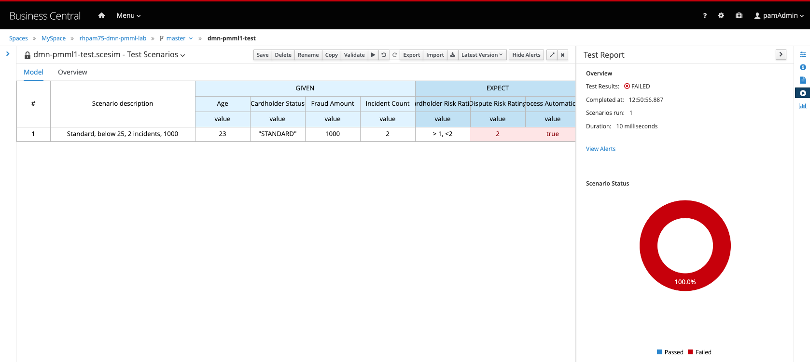

11. Set the expected value of `Dispute Risk Rating` to `> 15, < 20`, and the value of `Process Automatically` to `false`. Run the test again and observe that the test now passes.

    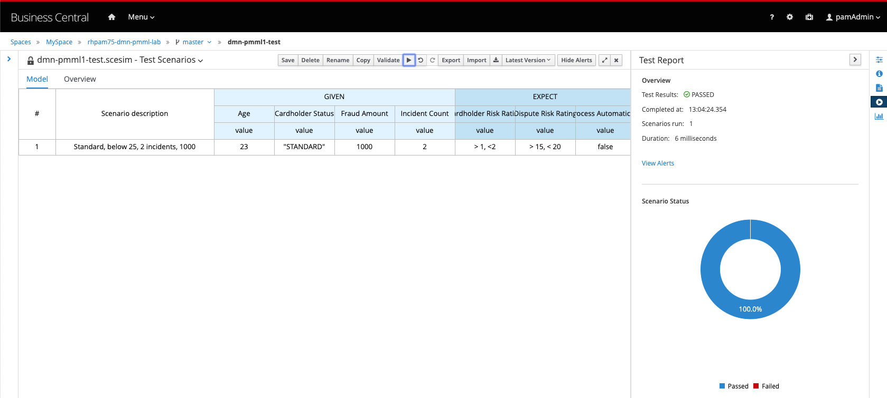

12. Implement some more tests by adding additional rows to your test scenario.

13. Save the tests.

Deploying and Running the Model
===============================

With our model implemented and tested, it’s now time to deploy our decisions to the execution environment.

1.  Go back to the Asset Library view of your project.

    

2.  Click on the **Deploy** button in the top right corner of the workbench.

3.  Go to the **Execution Servers** view via Menu → Deploy → Execution Servers.

    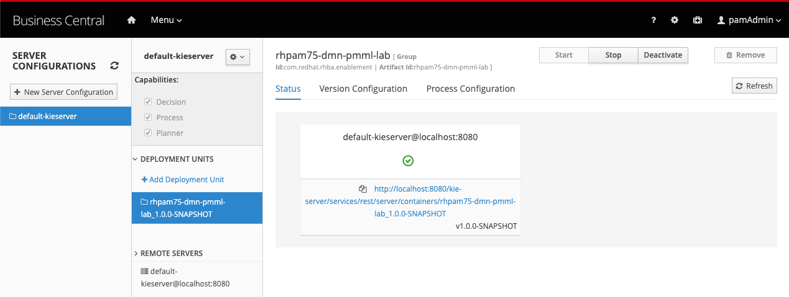

4.  The deployment-unit (KJAR) is deployed on the Execution Server/KIE-Server.

5.  Go to the **Swagger-UI** of your KIE-Server. In a local installation of RHPAM, the page can be found at: <http://localhost:8080/kie-server/docs>

6.  Scroll down until you see the section **DMN Models**.

7.  Click on the `POST` operation to expand the API definition.

    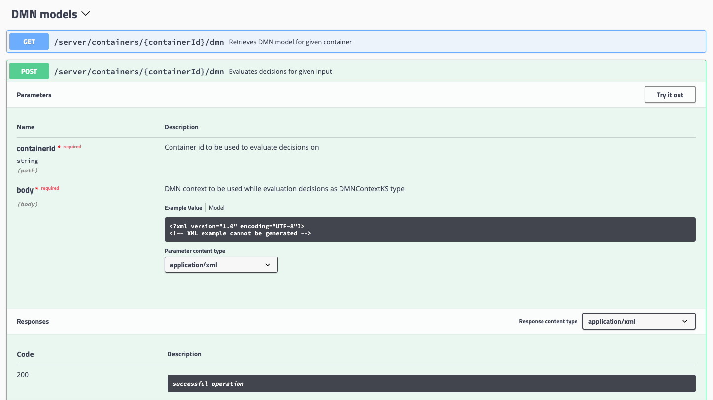

8.  Click on the **Try it out** button on the right-hand side of the screen.

9.  Use the value `rhpam75-dmn-pmml-lab` as the *containerId*, set the *Paramater content type* dropdown box to `application/json`, set the *Response content type* (the dropdown box under the blue **Execute** button) to `application/json` and use the following JSON data as the *body*:

    ``` json
    { "model-namespace":"http://www.redhat.com/rhpam/enablement/dmn_pmml", "model-name":"creditDisputeSimpleInputPmml1", "dmn-context": { "Age": 23, "Incident Count": 2, "Cardholder Status": "STANDARD", "Fraud Amount": 1000 } } 
    ```

10. The response should look like this. Note that the result not only shows the result of the final decision (i.e. `Process Automatically`), but also the result of the other decisions (`Dispute Risk Rating` and `Cardholder Risk Rating`).

    ```json
    { "type": "SUCCESS", "msg": "OK from container *rhpam75-dmn-pmml-lab*", "result": { "dmn-evaluation-result": { "messages": [], "model-namespace": "http://www.redhat.com/rhpam/enablement/dmn_pmml", "model-name": "creditDisputeSimpleInputPmml1", "decision-name": [], "dmn-context": { "Dispute Risk Rating": 17.268977295351846, "Process Automatically": false, "Cardholder Risk Rating": 1.7805601031011, "Fraud Amount": 1000, "Cardholder Risk Model": "function Cardholder Risk Model( age, holder_index, incidents )", "Cardholder Status": "STANDARD", "Dispute Risk Model": "function Dispute Risk Model( amount, holder_index )", "Age": 23, "Incident Count": 2 }, "decision-results": { "_c4f764e7-52d0-489e-a1df-fe264a8615bf": { "messages": [], "decision-id": "_c4f764e7-52d0-489e-a1df-fe264a8615bf", "decision-name": "Cardholder Risk Rating", "result": 1.7805601031011, "status": "SUCCEEDED" }, "_2523907c-978f-4f2e-a9cb-3d349c83c335": { "messages": [], "decision-id": "_2523907c-978f-4f2e-a9cb-3d349c83c335", "decision-name": "Process Automatically", "result": false, "status": "SUCCEEDED" }, "_7806a972-6dc1-46b3-81e7-ff48ac763f0f": { "messages": [], "decision-id": "_7806a972-6dc1-46b3-81e7-ff48ac763f0f", "decision-name": "Dispute Risk Rating", "result": 17.268977295351846, "status": "SUCCEEDED" } } } } } 
    ```

