Case Management
===============

This is a Case Management lab in which will implement a Credit Card Dispute case. The process will use BPMN2 constructs like **Milestones**, **User Tasks**, **Gateways**, combined with decision-based routing based on **Business Rules Tasks**. It introduces the dynamic concepts of the Red Hat Process Automation Manager case management support, like **autostart semantics** and **casefile-based milestone completion**.

# Goals

-   Create an Credit Card Dispute project in Red Hat Process Automation Manager.

-   Define and create the case’s domain model using the platform’s Data Modeller.

-   Implement an credit card dispute case in the process designer

-   Implement decision logic in a Decision Table.

-   Implement milestone completion logic using Drools logic.

-   Create forms with the platform’s Form Modeller.

-   Deploy the project to the platform’s Execution Server.

-   Execute the end-to-end case.

# Pre Reqs

-   Successful completion of the *Environment Setup Lab* or

-   An existing, accessible, DM/PAM 7.3+ environment.

## Case Management Terminology

Case Management introduces a number of additional concepts and terminologies on top of business process management. In this lab there are a number of key components that we will use, which we will introduce here:

-   *Case File*: The Case information is represented by the *Case File*. It contains *Case File Items* that can be any type of data structure, *Case File* serves as the context for raising events and evaluating Expressions, as well as point of reference to guide the execution of the process. All the data, including documents that we need to get to be bale to solve the dispute, will be stored in the *Case File*.

-   *Stage*: Stages may be considered “episodes” of a Case, though Case models allow for defining Stages that can be planned in parallel as well. You would normally group tasks that logically belong together in a stage.

-   *Milestone*: A Milestone represents an achievable target, defined to enable evaluation of progress of the Case. No work is directly associated with a Milestone, but completion of set of tasks or the availability of key deliverables (information in the Case File) typically leads to achieving a Milestone.

-   *Human Task*: Is a Task that is performed by a Case worker.

-   *Process Task*: Can be used in the Case to call a Business Process.

-   *Decision Task*: Can be used in the Case to invoke a Decision. A Decision in CMMN is an abstraction of Decisions as they are specified in various Decision Modeling specifications.

Another characteristic of a case is that it has a more dynamic lifecycle than a regular process. In a regular process the final state is: finalized. This can be due to completeness, error, or abortion of the process instance, but once the process is terminated you can’t restart it. This is different in a case management platform. In case management, case owners are able to, for example, re-open a completed case. A use-case can, for example, be to re-open a dispute case when the credit-card holder is not happy with the outcome of the dispute. In the following picture we can see the lifecycle of a case.

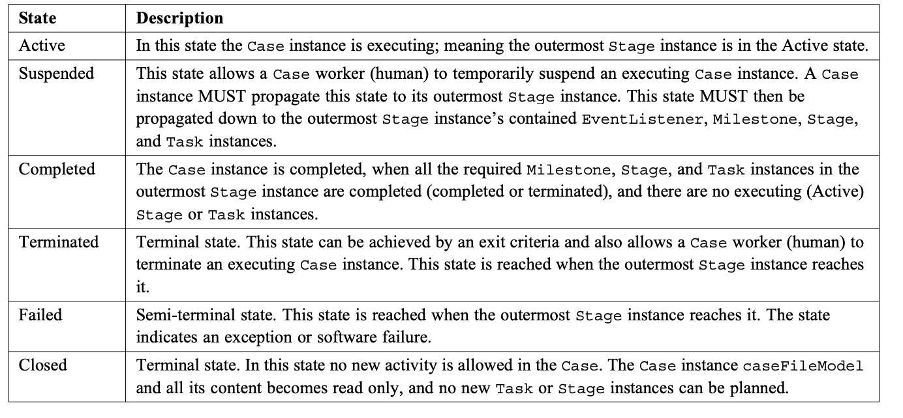

Problem Statement
=================

You are in charge of automating the business process to solve a dispute. Solving a credit card dispute depends on several variables, like the type of customer, his/her status, the amount of the dispute etc. The knowledge of how to apply these rules and decisions is tacit, and lives only in the head of other domain experts like you. In order to automate the process you have to first explicitly define the various steps and structure of the process.

A Credit Card Dispute process is not a straightforward process, nor is it fully structured. You usually don’t start at point A and then follow the path to point B, all the way through the process in a fully pre-defined, structured, flow. What happens is that, depending on the decisions made during the execution the of process instance, and most importantly the data of the case, you will jump back and forth between different steps to solve the dispute.

In this lab we will create an Credit Card Dispute case that manages the dispute of a credit card transaction.

-   Start the process by providing the order information.

-   The procurement department decides what kind of order this is and which supplier to involve.

-   The supplier sends an offer stating the expected delivery date and its best offer.

-   Depending on the order category, the urgency and the price, the order can be auto-approved by business rules.

-   If the order is not auto-approved, the manager needs to complete an approval step.

## Overview

The *Issuer* will gather information from the Credit Card Holder and the merchant to store it in the *Case File*. The *Case File* is a collection of case data, or case file items, that is defined and stored on case-instance level. I.e. all activities, sub-process, stages and process fragments have access to a single collection of data for that specific case instance, the Case File. This Case File can be accessed by all of the actors at any time, but you can also define Role Based Access Controls to protect the information.

Case management planning is typically concerned with determination of which Tasks are applicable, or which follow-up Tasks are required, given the state of the Case. Cases are directed not just by explicit knowledge about the particular Case and its context represented in the Case File, but also by explicit knowledge encoded as rules by business analysts, the tacit knowledge of human participants, and tacit knowledge from the organization or community in which participants are members.

## The Modeler

To model cases and processes, the Business Central workbench provides a web-based BPMN2 designer. Let’s explore it in more detail.

**TODO**: Replace with Stunner 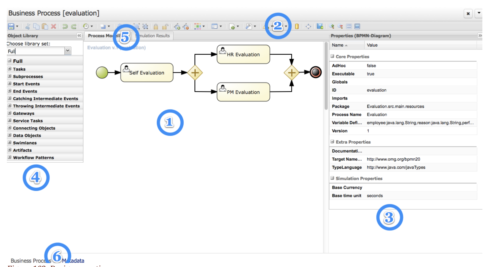

1.  *Modelling Canvas*: This is your process drawing board. After dropping different shapes onto the canvas, you can move them around, connect them, etc. Clicking on a shape on the canvas allows you to set its properties in the expandable Properties Window (3) (as well as create connecting shapes and morph the shape into other shapes).

2.  *Toolbar*: The toolbar contains a vast number of functions offered by Designer (described later). These includes operations that can be performed on shapes present on the Canvas. Individual operations are disabled or enabled depending on what is selected. For example, if no shapes are selected, the Cut/Paste/Delete operations are disabled, and become enabled once you select a shape. Hovering over the icons in the Toolbar displays the description text of the operation.

3.  *Properties Panel*: This expandable section on the right side of Designer allows you to set both process and shape properties. It is divided into four sections, namely "Core properties", "Extra Properties, "Graphical Settings" and "Simulation Properties". After clicking on a shape in the Canvas, this panel is reloaded to show properties specific to that shape type. If you click on the canvas itself (not on a shape) the panel displays general process properties.

4.  *Object Library Panel*: The expandable section on the left side of Designer shows the jBPM BPMN2 (default) shape repository tree. It includes all shapes of the jBPM BPMN2 stencil set which can be used to assemble your processes. If you expand each section sub-group you can see the BPMN2 elements that can be placed onto the Designer Canvas (1) by dragging and dropping the shape onto it.

5.  *View Tabs*: Currently, Designer offers three tabs for Process Modelling, Simulation and Documentation. Process Modelling is the default tab. When users run process simulation, its results are presented in the Simulation tab. Process Documentation tab displays documentation generated from process definition.

6.  *Info Tabs*: There are two additional tabs at the top of Designer. The *Editor* tab includes the process modeling, while the *Overview* tab displays the process metadata such as version history, creation date, last modification date etc.

## Domain Model and Decisions

Cases are *data-driven* dynamic processes. The activation of *stages*, completion of *milestones*, etc. is controlled by the status of the data in a *Case File*. Hence the, *data-model* of a case is very important.

To give you a kick-start in this case management lab, we’ve already pre-created the domain model and business-rules/decisions for you that we will be using in this project.

You can import the project from this Github repository: <https://github.com/DuncanDoyle/rhpam-case-management-lab-project>

**TODO**: Explain how to import a project

The domain model consists of the following classes:

1.  CreditCardHolder: `com.myspace.ccd_project.CreditCardHolder`

2.  FraudData: `com.myspace.ccd_project.FraudData`

3.  AdditionalInformation: `com.myspace.ccd_project.AdditionalInformation`

The details are shown in the tables below:

<table><caption>com.myspace.ccd_project.CreditCardHolder</caption><colgroup><col style="width: 33%" /><col style="width: 33%" /><col style="width: 33%" /></colgroup><tbody><tr class="odd"><td>
Id
</td><td>
Label
</td><td>
Type
</td></tr><tr class="even"><td>
age
</td><td>
Age
</td><td>
Integer
</td></tr><tr class="odd"><td>
balanceRatio
</td><td>
Balance Ratio
</td><td>
Float
</td></tr><tr class="even"><td>
incidentCount
</td><td>
Number of Previous Incidents
</td><td>
Integer
</td></tr><tr class="odd"><td>
riskRating
</td><td>
Risk Rating
</td><td>
Integer
</td></tr><tr class="even"><td>
stateCode
</td><td>
State Code
</td><td>
String
</td></tr><tr class="odd"><td>
status
</td><td>
Status
</td><td>
String
</td></tr></tbody></table>

<table><caption>com.myspace.ccd_project.FraudData</caption><colgroup><col style="width: 33%" /><col style="width: 33%" /><col style="width: 33%" /></colgroup><tbody><tr class="odd"><td>
Id
</td><td>
Label
</td><td>
Type
</td></tr><tr class="even"><td>
automated
</td><td>
Automated
</td><td>
Boolean
</td></tr><tr class="odd"><td>
customerStatus
</td><td>
Customer Status
</td><td>
String
</td></tr><tr class="even"><td>
disputeRiskRating
</td><td>
RiskRating
</td><td>
Integer
</td></tr><tr class="odd"><td>
lineItemCount
</td><td>
LineItem
</td><td>
Integer
</td></tr><tr class="even"><td>
maxDaysElapsed
</td><td>
MaxDays
</td><td>
Integer
</td></tr><tr class="odd"><td>
totalFraudAmount
</td><td>
FraudAmount
</td><td>
Float
</td></tr></tbody></table>

<table><caption>com.myspace.ccd_project.AdditionalInformation</caption><colgroup><col style="width: 33%" /><col style="width: 33%" /><col style="width: 33%" /></colgroup><tbody><tr class="odd"><td>
Id
</td><td>
Label
</td><td>
Type
</td></tr><tr class="even"><td>
answerValue
</td><td>
AnswerValue
</td><td>
String
</td></tr><tr class="odd"><td>
questionId
</td><td>
QuestionId
</td><td>
Integer
</td></tr><tr class="even"><td>
questionPrompt
</td><td>
QuestionPrompt
</td><td>
String
</td></tr><tr class="odd"><td>
questionType
</td><td>
QuestionType
</td><td>
String
</td></tr><tr class="even"><td>
maxDaysElapsed
</td><td>
MaxDays
</td><td>
Integer
</td></tr><tr class="odd"><td>
totalFraudAmount
</td><td>
FraudAmount
</td><td>
Float
</td></tr></tbody></table>

We’ve also pre-defined the following business-rules/decisions for you:

1.  automated-chargeback: Guided Rule: determines whether the CreditCardHolder is eligible for automated chargeback based on his or her status.

2.  automatic-approval: DRL: adds an `approvedChargeback` boolean to the `CaseFile` if the `FraudData.automated` field has been set to `true`.

3.  risk-evaluation: Guided Decision Table: determines the `Risk Scoring` of the `FraudData` based on `FraudData` and `CreditCardHolder` information.

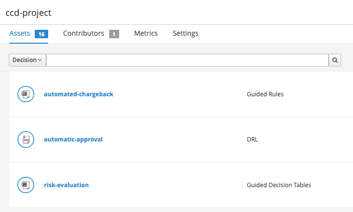

# Creating your first Case Definition

To create your first Case Definition:

1.  Go to your library view and click on *Add Asset*. From the asset catalog select "Case Definition". Configure the following values:

Name: `ChargeDispute` Package: `com.myspace.ccd_project`

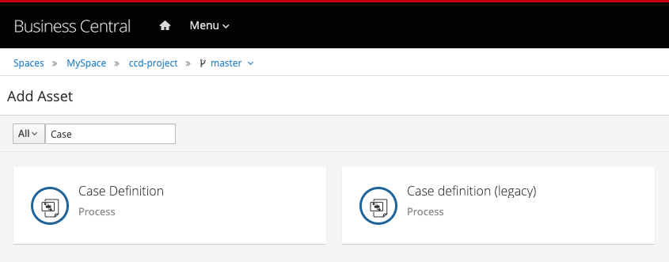

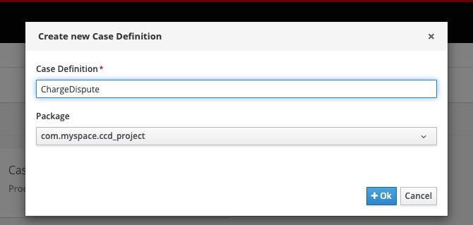

## Case Variables

We will first define our case variable. These variables will be used to store the case data during the execution the case.

1.  In the properties panel on the right-hand-side of the screen, scroll down to the bottom and expand the "Case Management" section. In the "Case File Variables" table, add the following variables:

<table><caption>Case File Variables</caption><colgroup><col style="width: 50%" /><col style="width: 50%" /></colgroup><tbody><tr class="odd"><td>
Name
</td><td>
DataType
</td></tr><tr class="even"><td>
customerStatus
</td><td>
String
</td></tr><tr class="odd"><td>
totalFraudAmount
</td><td>
Float
</td></tr><tr class="even"><td>
fraudData
</td><td>
com.myspace.ccd_project.FraudData
</td></tr><tr class="odd"><td>
approvedChargeback
</td><td>
Boolean
</td></tr><tr class="even"><td>
creditCardholder
</td><td>
CreditCardHolder
</td></tr></tbody></table>

At the end your variable definitions should look like this:

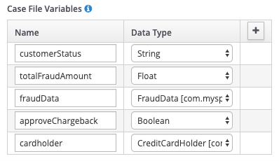

## Case Roles

In the Credit Card Dispute case, we can identify different roles. The mapping of the users and/or groups to these case roles is done when the case instance is started, and can be changed afterwards.

1.  On the properties panel look for the Case Roles table (just above the Case File Variables definition). Add the following roles:

<table><caption>Case File Variables</caption><colgroup><col style="width: 50%" /><col style="width: 50%" /></colgroup><tbody><tr class="odd"><td>
Name
</td><td>
Cardinality
</td></tr><tr class="even"><td>
owner
</td><td>
1
</td></tr><tr class="odd"><td>
approval-manager
</td><td>
1
</td></tr></tbody></table>

The cardinality refers to the number of actors that can be mapped to a role.

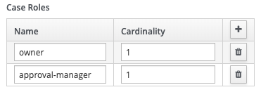

# Milestones and Signals

You will learn in this section:

1.  What are Milestones and when to use them.

2.  How to model a case using Milestones.

3.  How to activate Milestones using Signals.

4.  How to complete Milestones.

## Milestones of the Case

In order to track the progress of a case instance, we need to define the relevant milestones for the customer. In our case, a milestone has to be defined to inform the Credit Card Holder, case owner and case workers that an important goal has been achieved. Some of these goals can be attained in parallel. After you have completed a milestone, there is still a possibility you can go back in the process and trigger the milestone again if needed. Also some of the milestones are discretionary, so they might never be triggered. A Milestone in a case definition is represented by the Milestone node .

We’ve identified the following milestones in our Credit Card Dispute case:

1.  Dispute started

2.  Chargeback approved

3.  Dispute rejected

These are the achievable targets to help us track the progress of the dispute. They don’t have any particular order, so you can come back to any of them if something in the Case File data changes.

Next you will learn how to model Milestones inside your Case Definition.

## Defining Milestones

To model the milestones of the case:

1.  Open the `ChargeDispute` process.

2.  Delete the default `Milestone` node from the diagram.

3.  Select from the Object Library Panel a Node of type *Script Node* (located in the *Tasks* section of the palette). Place it on the canvas. On the properties panel for the *Script Node* enter the following:

        Name: Log Case Started
        Script  System.out.println("Case started");
        AdHoc Autostart: True

    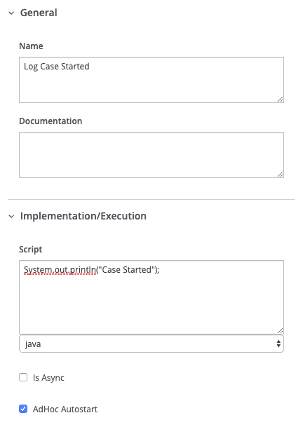

    We have not defined a *Start* node in our case. By enabling the `AdHoc Autostart` on the script node, the node will be activated and executed automatically when the case is started.

    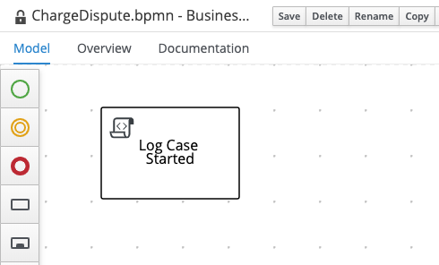

4.  Add an *End Event* of type *Signal* and set the signal name to `Dispute_Received`. Make sure to set the *Signal Scope* to `Process Instance`. This will trigger a Milestone called `Dispute Received`. Note that triggering the *Milestone* only activates it, it does not complete it. A *Milestone* is completed when its *Condition* is met.

        Signal:  Dispute_Received
        Signal Scope: Process Instance

    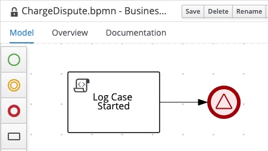

5.  Add a *Milestone* node. Note that for the *Milestone* to be triggered by the *Signal End Event* we created earlier, the *Signal Ref* of the event should have the exact same name as the *Name* of the *Milestone*. We set the condition to trigger when the `fraudData` case file item is not `null`.

    You can set the `Condition` of a *Milestone* in the *Data Assignements - Assignments* properties of the *Milestone* node. Simply select the node, and click on the edit icon (pencil) of the`Assignments` field in the `Data Assignments` section of the property editor (the panel on the right side of the screen). This will open the *Data Input/Output Assignments* editor. The data-input `Condition` should already be listed. In the *Source* field, select `Constant`, and type (or paste) the condition expression.

        Name:  Dispute_Received
    Condition: CaseData(data.get("fraudData") != null)
        AdHoc Autostart: false

    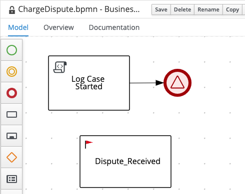

    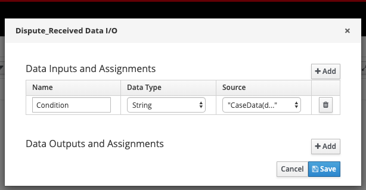

    As we saw earlier with our script task, ad hoc nodes with no incoming connections, like the *Milestone* we’ve just defined, can be configured with the `Adhoc autostart` property, which is a property of the node itself. This will activate the node automatically when the case is started. Another way of triggering/activating an *ad hoc* node is by signalling it. In this case our *Signal End Event* triggers our *Milestone* node and activate it. Remember that milestone activation does not complete it. A milestone is completed when it’s completion condition is met. In another words, completion of a milestone is driven by conditional expressions on the state of the data. It is data-driven.

6.  Save your process/case definition.

7.  Go back to your project’s *Asset Library* view. Click on the *Deploy* button in the upper right corner of the screen. This will package and deploy your project to the Execution Server. The workbench will display 2 green notification bars, stating the build and deployment were successful.

8.  Go to *Menu → Manage → Process Definitions*. You will see you `ChargeDispute` listed.

    

    As part of the pre-defined project, we’ve already created the Case Start Form, which will allow you to start the case and provide its input data.

9.  Click on the kebab icon on the right side of the process/case definition. Click on *Start* to start the case. This will open the case start form that was provided by us, and which allows you to enter the data to your first case instance.

    

10. The start form allows us to specify the mappings for the case roles and groups, as well as the Credit Card Dispute input data for our case. Fill in the following details (make sure to set the `owner` to `pamAdmin`. Failing to do so will prevent the case from being displayed in our case app for your `pamAdmin` user). When you’ve filled in the input data, click on the *Submit* button, which will start your case.

    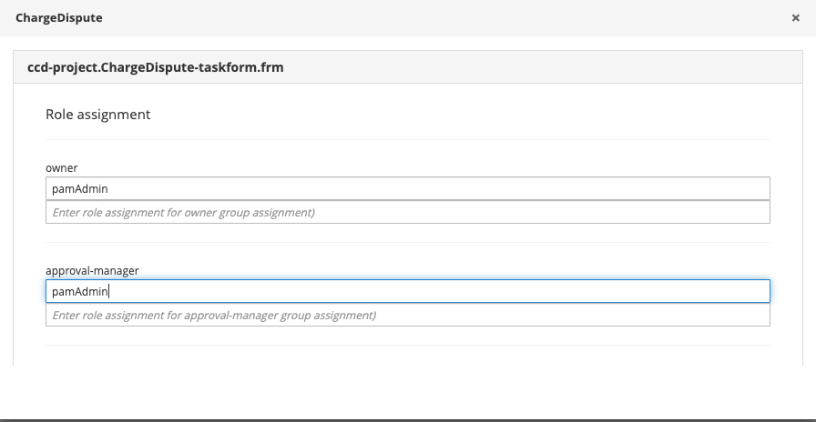

    

    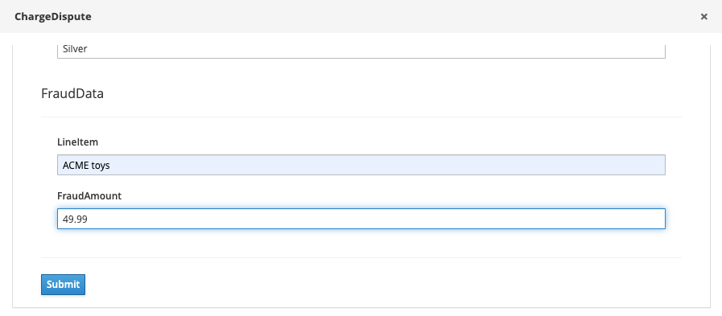

11. The screen will automatically change to the *Process Instance Details* screen of the process/case you’ve just started. Click on the *Diagram* tab to see the diagram of your case, and the nodes that have been traversed in your case instance. Note that the *Milestone* was both triggered (by the *Signal End Event*), as well as completed (by the *Condition* that evaluated to `true`).

    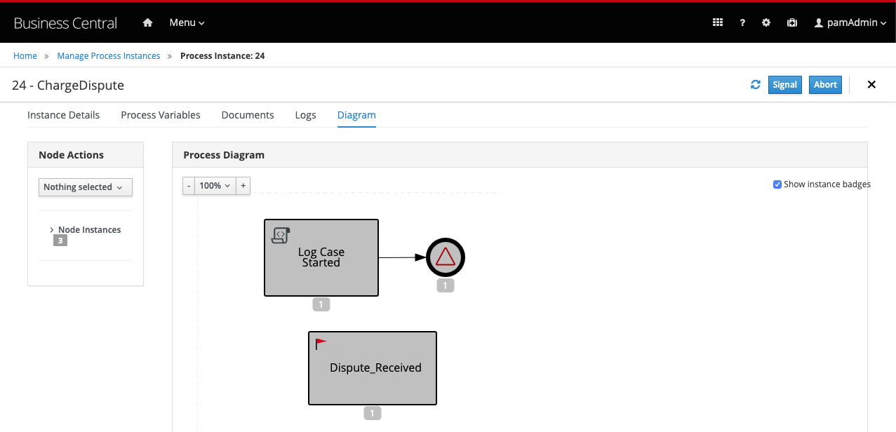

12. Click on the *Process Variables* to get an overview of the current state /values of the Case. Note that `fraudData` is indeed set, which was the *Condition* that completed our *Milestone*.

    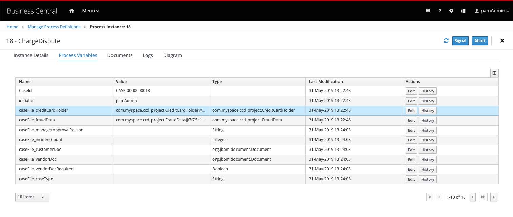

13. The platform also provides a *Case Management Showcase* application, which is an example of how a custom Case Management dashboard could be composed. Open this application by clicking on the *Application Launcher* button on the top right of the screen. Next, click on *Case Management Showcase*. Login with the same credentials that you used for the Business Central Workbench (u:pamAdmin, p:redhatpam1!).

    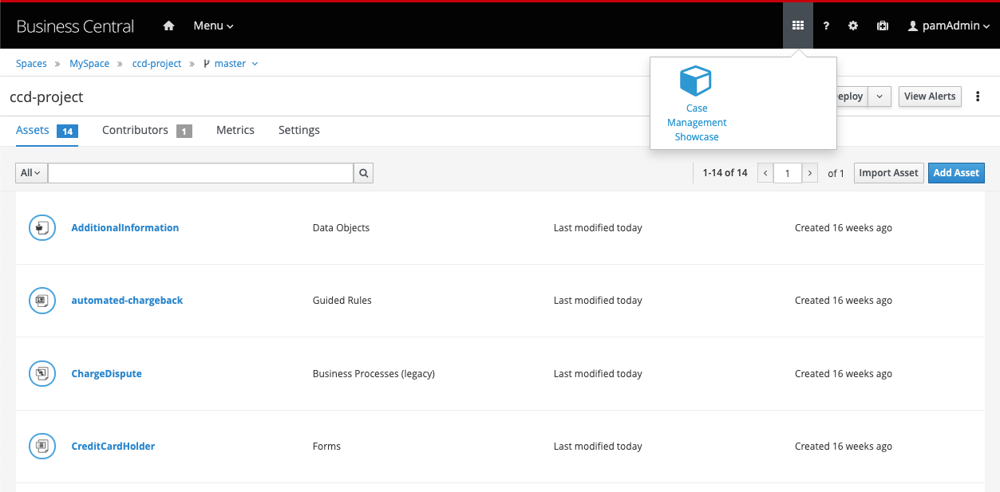

14. The showcase application will list the current open cases. You will see the case you’ve just started in the list:

    

15. Click on the case to open a detailed view of the open case. This view will, among other things, list the completed milestones, the available actions, the actions that are in progress, the completed actions and the case roles. Take some time to explore the details of your case.

    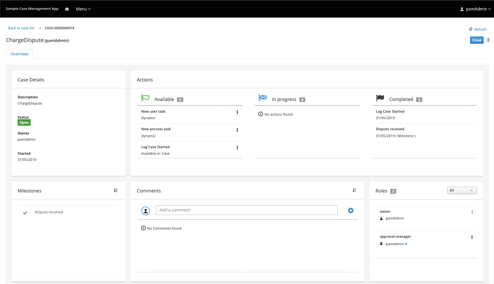

So far we’ve configured the initial process, a signal end-event that triggers the milestone, and a milestone conditional expression which fired based on the case data.

In the next section we will add our rules, decisions and user-tasks to our project.

# Decisions Integration.

In this section you will learn:

1.  How to reuse the Decision making assets inside a Case Management definition.

2.  How to configure and use a Business Rule Node inside a Case Management Definition.

## The Credit Card dispute case

There are several thing that could happen when you dispute a case, we will see 2 different scenarios

# Automated Chargeback

A credit card dispute over billing errors has a good chance of being resolved in your favour thanks to the Fair Credit Billing Act, which regulates how credit card companies handle these disputes. The amount of the transaction, or your status as a customer can also qualify you for an automated chargeback.

The process would look like as follows:

1.  CC Holder starts the dispute.

2.  The information of the case is automatically evaluated by business rules and the decision of an automated chargeback is taken.

3.  The issuer of the Credit Card (CC) will credit the disputed amount into your account.

# Using Business Decisions in a Case

To be able to decide the type of processing of the Credit Card Dispute we need to apply the rules for automatic chargeback processing that we automated in the previous scenario. The rules look like this:

If you open the asset, you will see that we’ve configured a property called `ruleflow-group`. This property is an attribute that can combine a number of rules into a group, after which the execution of those rules can be controlled by activating the `ruleflow-group` from the process/case via a decision node.

The evaluation to decide if a chargeback should be automatic is the first step after the dispute is started, so we are going to add the step right after the `Dispute received` is triggered. Remember that *Milestones* don’t perform any actions, they mark a target of the case as achieved. However, functionality can be linked to these *Milestone* nodes. These nodes will start after the *Milestone* is completed.

1.  Add a node of type `Business Rule` after the `Dispute_Received` milestone node (the `Business Rule` node can be found in the `Tasks` section of the palette). In the properties panel add the following information:

        Name:  `Check for automated chargeback`
        Task Type: Business Rule
        Rule Flow Group: `automated-chargeback`

    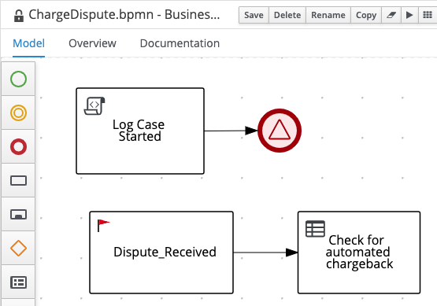

2.  For the rule to evaluate the facts, we need to correctly insert the facts into the rule-engine. We can do this via the nodes Input/Output Data mapping. If we specify a process variable or case file item in the Data Input section, that data will be inserted as a fact into the rules engine’s so called *Working Memory*. If we specify the same fact, with the same names, in the Data Output section, the fact will, after rule-evaluation, also be retracted from *Working Memory*. This last part is important when you have multiple Business Rules nodes in your process and/or case definition, and you want to be sure that the rules are only evaluating the data that you’re entering in that specific node. Select the `Business Rule` node we’ve just created, and in the properties panel click on the *Assignments* property to open the Data Input Output editor.

3.  The automated chargeback rule evaluates the `CreditCardHolder` and the `FraudData`. We therefore need to insert these 2 *case file items* directly into the Working Memory of the engine. Configure the Data Input/Output mapping of your business rule node as follows:

    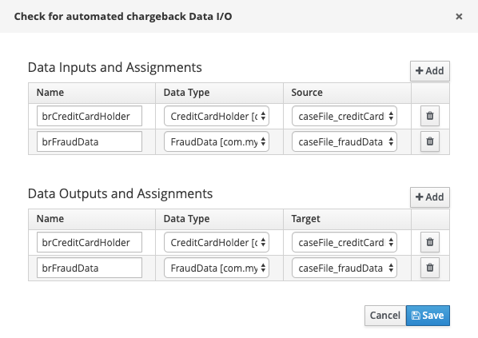

    As part of the rule’s action (the right-hand-side, or consequence, of the rule), the case data might change. For example, when the dispute is eligible for automated chargeback, the rule will change the `FraudData` fact/case file item by setting its `automated` property to `true`. Hence, we wan to use a conditional gateway to decide whether we can do automatic approval or not.

4.  Add an `X-Or Gateway` after your `Check for automated chargeback` Business Rule node.

    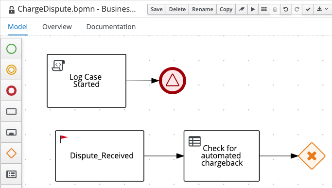

5.  Create 2 new script tasks, one called `Automatic Approval` and the other called `Manual Approval`. These serve only as placeholders, so they do not need to have a script implementation. Connect the 2 tasks to the X-OR gateway. Give one of the *Sequence Flows* (the arrows connecting the nodes) the name `automatic` and the other the name `manual`. Not only is naming the sequence flows after a gateway a good practice, it also helps when selecting the default flow in the next step of this lab.

    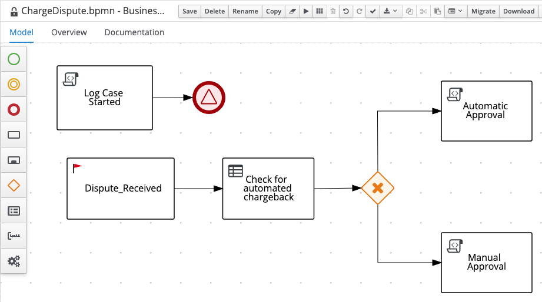

6.  We can now implement the conditional expressions on the *X-OR Gateway* and the *Sequence Flows* connecting the gateway to the task nodes. We’re first going to define the *Default gate* of the gateway. I.e. the path that should be taken when no conditions are met. Select the *X_OR Gateway* node, open the properties panel on the right side of the editor and set the `Default gate` property to the `manual` flow. 

7.  Select the `automatic` *Sequence Flow*. In the properties panel, set the following expression in the *Script`* tab of the expression editor:

Expression: `return (caseFile_fraudData.getAutomated()) != null && (caseFile_fraudData.getAutomated() == true);`

The expression will activate when the `automated` field of the `FraudData` has been set (not `null`) and the value is `true`.

* Save the case definition and deploy the project to the execution server by clicking on the *Deploy* button from the *Asset Library* perspective.

1.  Start a new case instance like we did in the previous lab. Use the same input data. Open the diagram of the Case/Process Instance and note that the dispute you’ve entered requires manual approval.

    

2.  Start a new case instance, but this time set the Credit Card Holder’s status to `Gold`. This should cause the rules to make the dispute eligible for automatic processing. Open the diagram of the Case/Process Instance and observe that the case has indeed taken the path of automatic processing.

    

You have just learned how to leverage the Decisions and Rules you authored in the previous scenario in your case definition. You have seen how the state of the data, in this case the Card Holder’s status, triggers rules. You’ve seen how the rules manipulate the state of the data, in this case setting the `automatic` field of the `FraudData` to `true`, which can drive decisions and flow directions within our case.

Apart from changing data, decisions and rules can also infer and create new data, as well as remove data from the case instance. Through decisions and rules, the data-driven approach of Case Management (in contrast to the flow driven approach of traditional BPM) allows for the implementation of very dynamic, data-driven, case logic.

# Case Authoring - Decisions and Human Tasks

You will learn in this section:

1.  How to further enhance your Case Model.

2.  Integrating Human Interaction with the Case Model.

## The Credit Card dispute case

As we saw in the previous steps, we’ve defined, through business rules, which disputes are eligible for automatic approval and which disputes require manual processing.

## Adding the Automatic and Manual Chargeback functionality.

Now that our case is able to determine whether a dispute can be automatically approved or needs a manual approval step, we can implement the actual approval logic, as well as the *Milestones* that track whether a dispute has been approved or rejected.

We will first create the *Milestones* and their conditions. Our case file contains a *case file item* called `approvedChargeback`, which is a `Boolean`. We will use this case file item in the conditional expressions of our milestones.

1.  Create a new *Milestone* node with the following characteristics:

        Name: Chargeback Approved
        Condition: CaseData(data.get("approvedChargeback") == true)
        Adhoc autostart: true

2.  Create a second *Milestone* with the following characteristics:

        Name: Dispute Rejected
        Condition: CaseData(data.get("approvedChargeback") == false)
        Adhoc autostart: true

    

    Setting the `Adhoc autostart` property activates these milestone nodes when the case is started. The milestones are completed when their condition is met.

3.  We now need to define and configure the logic that sets the `approvedChargeback` case file item to `true` or `false`. In the case of *automatic* processing, we want to implement this logic using rules. In the case of *manual* processing, we want to allow a user to set this value via a so called *User Task* or *Human Task*. We’ve already provided the rules for the automatic approval, which are defined in a DRL (Drools Rule Language) file called `automatic-approval.drl`.

    

    As can be seen in the screenshot, the rule sets the `approvedChargeback` case file item to `true` when `automated` field of `FraudData` is set to `true`. Obviously, this is a very basic rule which in essence approves the chargeback for every dispute that is eligible for automated approval. Nevertheless, it demonstrates how rules can be used to manipulate data in the case file, and how more advanced rules can make use of this functionality.

    Also note that the name of the *ruleflow-group* is set to `automatic-approval`. We need this *ruleflow-group* and use it in our *Business Rule Task*.

4.  To use the rule, change the `Automatic Approval` script task into a *Business Rule Task* and set its *ruleflow-group* property to `automatic-approval`.

    

    

5.  Configure the following *Data Assignments* for the `Automatic Approval` Business Rule Task:

    <table><caption>Data Input and Assignments</caption><colgroup><col style="width: 33%" /><col style="width: 33%" /><col style="width: 33%" /></colgroup><tbody><tr class="odd"><td>
Name
</td><td>
Data Type
</td><td>
Source
</td></tr><tr class="even"><td>
brCreditCardHolder
</td><td>
CreditCardHolder
</td><td>
caseFile_creditCardHolder
</td></tr><tr class="odd"><td>
brFraudData
</td><td>
Fraud Data
</td><td>
caseFile_fraudData
</td></tr></tbody></table>

    <table><caption>Data Output and Assignments</caption><colgroup><col style="width: 33%" /><col style="width: 33%" /><col style="width: 33%" /></colgroup><tbody><tr class="odd"><td>
Name
</td><td>
Data Type
</td><td>
Source
</td></tr><tr class="even"><td>
brCreditCardHolder
</td><td>
CreditCardHolder
</td><td>
caseFile_creditCardHolder
</td></tr><tr class="odd"><td>
brFraudData
</td><td>
FraudData
</td><td>
brFraudData
</td></tr></tbody></table>

    

6.  For the manual approval part of the flow, we first want to apply the credit risk scoring rules that we’ve defined in the previous module. This will create the risk scoring information for the user to assess the risk of the dispute. Convert the `Manual Approval` script task into a *Business Rule Task* and set its *ruleflow-group* to `risk-evaluation`. Name it `Credit Risk Evaluation`.

    

7.  Configure the following *Data Assignments* for the `Credit Risk Evaluation` Business Rule Task:

    <table><caption>Data Input and Assignments</caption><colgroup><col style="width: 33%" /><col style="width: 33%" /><col style="width: 33%" /></colgroup><tbody><tr class="odd"><td>
Name
</td><td>
Data Type
</td><td>
Source
</td></tr><tr class="even"><td>
brCreditCardHolder
</td><td>
CreditCardHolder
</td><td>
caseFile_creditCardHolder
</td></tr><tr class="odd"><td>
brFraudData
</td><td>
Fraud Data
</td><td>
caseFile_fraudData
</td></tr></tbody></table>

    <table><caption>Data Output and Assignments</caption><colgroup><col style="width: 33%" /><col style="width: 33%" /><col style="width: 33%" /></colgroup><tbody><tr class="odd"><td>
Name
</td><td>
Data Type
</td><td>
Source
</td></tr><tr class="even"><td>
brCreditCardHolder
</td><td>
CreditCardHolder
</td><td>
caseFile_creditCardHolder
</td></tr><tr class="odd"><td>
brFraudData
</td><td>
FraudData
</td><td>
brFraudData
</td></tr></tbody></table>

    

8.  Next, we want to define the actual user task. Create a *User Task* node and attach it to the `Credit Risk Evaluation` rule task. Configure the task as follows:

        Name: Manual Approval
        Task Name: manual_approval
        Actors: pamAdmin

    Also, configure the following data assignments (Make sure to use these exact names, otherwise the provided screens for our user task will not work properly due to incorrect data-binding!!!):

    <table><caption>Data Input and Assignments</caption><colgroup><col style="width: 33%" /><col style="width: 33%" /><col style="width: 33%" /></colgroup><tbody><tr class="odd"><td>
Name
</td><td>
Data Type
</td><td>
Source
</td></tr><tr class="even"><td>
htCreditCardHolder
</td><td>
CreditCardHolder
</td><td>
caseFile_creditCardHolder
</td></tr><tr class="odd"><td>
htFraudData
</td><td>
Fraud Data
</td><td>
caseFile_fraudData
</td></tr></tbody></table>

    <table><caption>Data Output and Assignments</caption><colgroup><col style="width: 33%" /><col style="width: 33%" /><col style="width: 33%" /></colgroup><tbody><tr class="odd"><td>
Name
</td><td>
Data Type
</td><td>
Source
</td></tr><tr class="even"><td>
htApprovedChargeback
</td><td>
Boolean
</td><td>
caseFile_approvedChargeback
</td></tr></tbody></table>

    

    

    We’ve already provided the forms for this user task for you. They are in the assets `manual_approval-taskform` and `ManualApproval_FraudData` (the latter one defines the form for the `FraudData` object. It is included in the `manual_approval-taskform`). We now just have to finish some last details of our case: termination.

9.  Add a *Terminating End Event* after both the `Chargeback Approved` and `Dispute Rejected` milestone. This makes sure that the process, and all open tasks and milestones are terminated when either one of these milestones is met.

    

10. Save the process.

11. You’ve now completed the full implementation of the case.

# Deploying the project

It’s time to deploy the project to the Execution Server and see it working. To achive this, go back to the *Assets Library* view and click on the *Deploy* button to deploy the project.

1.  Start a case with the data that would require manual approval. Any case with a Credit Card Holder having a *Silver* status will do. Open the process instance diagram of the case and observe that the process is waiting in the `Manual Approval` user task.

    

2.  In the workbench, go to *Menu → Track → Task Inbox*. If everything is correct, the user task of the case you’ve just started should be in your inbox:

    

3.  Click on the task to open it. You will see some of the details of the dispute, including the *Risk Rating* that is determined by our rules. Enable the *Approve Chargeback* checkbox to approve the dispute, or keep it disabled to reject it. Click on the *Complete* button to complete the task:

    

4.  Go back to the *Process Instance* list and notice that your process/case is no longer listed. In the filter section on the left-hand-side of the screen, enable *Completed*

    

5.  You will see your process/case in the list. Select it to open the process instance details screen. Open the *Diagram* tab. Note that the dispute has been approved, as the *Chargeback Approved* milestone has been completed.

    

    The `Dispute Rejected` milestone is greyed out as well in the diagram. This is however due to the *Termination* node after the `Chargeback Approved` milestone, which has terminated all active nodes in the process, including the `Dispute Rejected` milestone. You can see in the diagram that the *Termination* node after the `Dispute Rejected` milestone was not reached.

You have successfully finished this lab. You’ve learnt how to build a full case definition containing milestones, signals, business rules, gateways, user tasks and terminators. You’ve seen how Case Management differs from traditional BPM in the sense that cases are dynamic and fully data-driven, relying on rules, data and events to drive the case execution.

The completed project can be found here: \[[https://github.com/DuncanDoyle/rhpam-case-management-lab-project-completed\](https://github.com/DuncanDoyle/rhpam-case-management-lab-project-completed](https://github.com/DuncanDoyle/rhpam-case-management-lab-project-completed](https://github.com/DuncanDoyle/rhpam-case-management-lab-project-completed))

> NOTE: -Dorg.jbpm.casemgmt.showcase.url=/rhpam-case-mgmt-showcase -Dorg.kie.server.location=http://localhost:8080/kie-server/services/rest/server -Dorg.jbpm.wb.forms.renderer.ext=true